# Production-Grade Engineering Reference Architecture

**Version:** 1.0
**Review date:** 2026-08-05
**Scope:** General-purpose, internet-facing applications; language-, framework-, cloud-, and industry-neutral
**Status:** Reference architecture and engineering control standard

> Vendored into `engineering-federation` on 2026-08-05 from the owner-supplied
> `PRODUCTION_GRADE_ENGINEERING_ARCHITECTURE.md` (v1.0). Content is verbatim except
> for restoration of transport-mangled characters (em-dashes, arrows, `×`, `≤`, `·`,
> box-drawing tree characters, apostrophes). Dime-specific adaptation lives in
> `dime-mapping.md`, never in this file.

## Evidence status

- **VERIFIED — source analysis:** The attached source was reviewed as a complete forensic-remediation runbook. Its strongest reusable mechanisms are risk-ranked execution, fail-closed controls, baseline measurement, explicit keep/delete boundaries, phased changes, deterministic verification, before/after evidence, owner-gated exceptions, and a concrete definition of done.
- **VERIFIED — repository corpus:** The upstream repositories listed in this document were reviewed as current, non-archived reference projects or specifications on 2026-08-05. They are used as implementation evidence, standards references, or comparative examples—not as a claim that one stack fits every application.
- **INFERRED — target architecture:** The architecture below is a synthesis. It is not copied from a single project. It combines stable patterns demonstrated by the reviewed projects with security, reliability, data, and release engineering controls.
- **UNKNOWN — application-specific decisions:** Traffic shape, data classification, tenancy, regulatory scope, availability target, latency target, RTO, RPO, region count, budget, and team topology must be supplied by the adopting application. Safe defaults are included where silence would otherwise produce an unsafe design.

---

## 1. Executive architecture decision

A production application SHOULD begin with the smallest topology that can satisfy its measured security, reliability, and scaling requirements:

1. A **modular application runtime** with explicit internal module boundaries.
2. An **edge gateway** for TLS termination, reverse proxying, load balancing, request normalization, route-level limits, and WebSocket upgrades.
3. An external or isolated **identity provider** for authentication and token issuance.
4. A separate **authorization policy decision point** for RBAC and ABAC decisions when policy complexity warrants it.
5. **Stateless application instances** behind the load balancer.
6. A durable **relational system of record**, with parameterized data access and controlled schema evolution.
7. A distributed **cache and rate-limit state store** that is never treated as the durable source of truth.
8. A dedicated **migration runner**, separated from normal application startup.
9. A vendor-neutral **telemetry pipeline** for logs, metrics, traces, alerts, and release evidence.
10. A controlled **software supply chain** that builds minimal containers, scans them, emits an SBOM, signs immutable artifacts, and promotes the same digest through environments.

The default is **not microservices**. Service extraction is justified only when one or more of the following are evidenced:

- independent scaling characteristics;
- a materially different security or data boundary;
- a distinct reliability objective;
- isolated deployment cadence or blast radius;
- separate data ownership;
- team ownership that cannot be maintained within a modular codebase;
- a workload that requires a different runtime model.

This progressive approach prevents a general reference architecture from imposing distributed-system failure modes before the application needs them.

---

## 2. Analysis of the attached source

### 2.1 What the source actually is

The attached material is a high-detail forensic audit remediation plan. It is organized around findings, execution phases, branch strategy, concrete file mutations, verification commands, evidence capture, and release boundaries. It is valuable as an **engineering governance model**, but it is not a reusable target-state architecture by itself.

### 2.2 Transferable strengths retained here

| Transferable mechanism | How this architecture adopts it |
|---|---|
| Severity-ranked findings | Controls and failure modes are classified by security, data, availability, and release impact. |
| Baseline before mutation | Every implementation phase records performance, security, database, image, and operational baselines. |
| Fail-closed security | Authentication, authorization, secret access, destructive migrations, and privileged mutations deny by default. |
| Explicit boundaries | Every component has owned responsibilities and prohibited responsibilities. |
| Small, reviewable phases | Adoption is split into edge, identity, data, delivery, verification, and resilience increments. |
| Structural remediation | Capacity or bundle limits are fixed by architecture, not repeatedly raised without reduction evidence. |
| Deterministic verification | Each architectural control has a machine-verifiable fitness function. |
| Before/after evidence | Releases carry exact artifact digests, test output, scan results, migration state, and rollout evidence. |
| Owner-gated exceptions | Compliance, data deletion, domain cutovers, history rewrites, and production mutations require explicit authority. |
| Concrete definition of done | The final section defines measurable completion instead of relying on narrative confidence. |

### 2.3 Gaps corrected in this architecture

The source does not define a generalized system context, runtime topology, API contract model, WebSocket lifecycle, IAM architecture, policy flow, cache design, load-balancing policy, indexing method, migration protocol, SLO model, observability pipeline, backup/restore model, or deployment profiles. This document supplies those missing target-state views while retaining the source's execution discipline.

---

## 3. Scope

### 3.1 In scope

This architecture covers:

- HTTP APIs;
- WebSockets;
- reverse proxying;
- JWT validation and session boundaries;
- RBAC and ABAC;
- TLS and certificate lifecycle;
- CORS;
- SQL-injection prevention;
- rate limiting;
- caching;
- load balancing;
- relational database indexing;
- database migrations;
- Docker-compatible containers;
- observability, resilience, backup, supply-chain security, and verification required to make the listed concepts production-grade.

### 3.2 Non-goals

This document does not prescribe:

- a frontend framework;
- a programming language;
- a cloud vendor;
- a Kubernetes requirement;
- a specific business domain;
- a specific multi-tenant model;
- a compliance certification;
- an event-driven architecture where none is required;
- service decomposition without evidence.

---

## 4. Quality attributes and default service tiers

The adopting team MUST replace inferred defaults with measured requirements before production launch.

| Attribute | Required architecture behavior | Default when unspecified |
|---|---|---|
| Confidentiality | TLS in transit, encryption at rest where supported, least privilege, no secrets in images or logs | Required |
| Integrity | Signed artifacts, migration checksums, authenticated mutations, tamper-evident release evidence | Required |
| Availability | Redundant stateless instances, health-aware routing, graceful degradation, tested recovery | 99.9% monthly service SLO |
| Latency | Per-route budgets, bounded downstream timeouts, cache only where evidence supports it | p95 ≤ 500 ms for ordinary synchronous API operations |
| Scalability | Horizontal stateless compute, externalized shared state, measured capacity thresholds | Load test to 2× forecast peak |
| Recoverability | Point-in-time recovery where available, automated backups, restore drills | RPO 15 minutes; RTO 60 minutes |
| Deployability | Immutable artifacts, progressive rollout, backward-compatible migrations | Zero planned downtime for routine releases |
| Operability | Structured logs, RED/USE metrics, distributed traces, actionable alerts, runbooks | Required before general availability |
| Auditability | Correlated identity, policy decision, mutation, release, and migration evidence | Required for privileged operations |
| Maintainability | Explicit module ownership, contract tests, dependency boundaries, ADRs | Required |

Recommended tiers:

| Tier | Availability | RTO | RPO | Typical use |
|---|---:|---:|---:|---|
| Standard | 99.9% | 60 min | 15 min | General SaaS, internal systems, non-critical consumer apps |
| Business-critical | 99.95% | 15 min | 5 min | Revenue paths, operational systems, contractual workloads |
| Mission-critical | 99.99%+ | 5 min | <1 min | Safety, financial, regulated, or high-cost interruption workloads |

These are planning defaults, not universal truths. The cost and topology rise materially at each tier.

---

## 5. Architecture principles

1. **Contracts before implementations.** APIs, events, policy inputs, database changes, and error semantics are versioned contracts.
2. **Identity is not authorization.** A valid token identifies a principal; a policy decision authorizes a specific action on a specific resource in a specific context.
3. **CORS is not access control.** It is a browser enforcement mechanism and never substitutes for server-side authorization.
4. **The cache is disposable.** The database or another explicitly designated durable store remains authoritative.
5. **Stateless compute by default.** Session, rate-limit, coordination, and durable data state live outside application processes.
6. **Fail closed where integrity is at risk.** Authentication, authorization, privileged mutation, migration, signing, and secret retrieval fail closed.
7. **Fail open only by explicit risk decision.** Low-risk telemetry and selected cache reads may degrade without blocking the product.
8. **Bound every wait and queue.** Requests, retries, connections, database statements, backfills, and message buffers have time, size, and attempt limits.
9. **Prefer backward-compatible evolution.** APIs, database schemas, tokens, and deployment revisions coexist during controlled transition windows.
10. **Promote immutable artifacts.** Build once; identify by digest; promote the same bytes through environments.
11. **Complexity must earn its existence.** Add services, clusters, queues, replicas, and regions only against a measured requirement.
12. **Evidence determines completion.** Generated code, a successful build, or a green unit test alone is not production evidence.

---

## 6. General system context

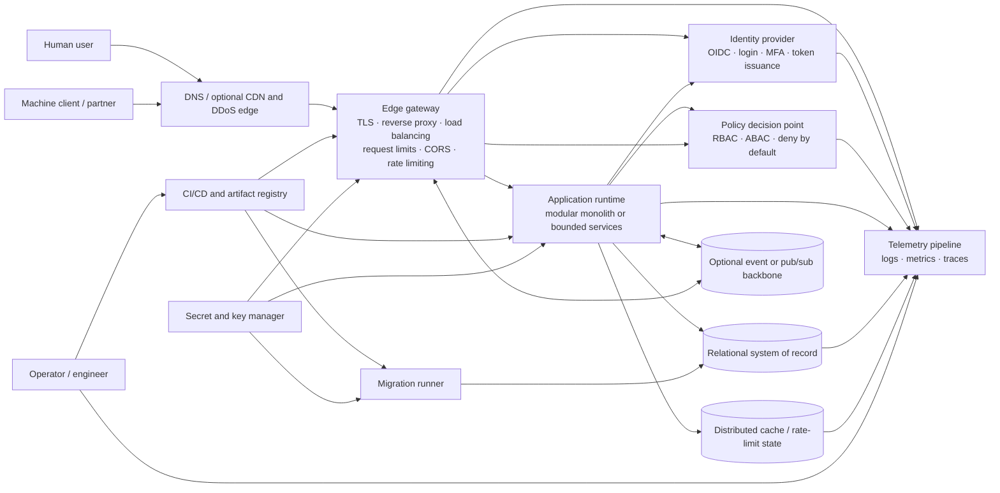

### 6.1 Mandatory versus conditional components

| Component | Status | Rule |
|---|---|---|
| Edge gateway | Mandatory for public production traffic | May be managed or self-hosted. |
| Identity provider | Mandatory for authenticated products | Local auth is acceptable only with equivalent controls and ownership. |
| Policy engine | Conditional | Keep policy in application modules for simple systems; externalize when policies span services, tenants, or dynamic context. |
| Relational database | Default durable store | Substitute only when a different data model is justified. |
| Distributed cache | Conditional | Add only after a measured latency, throughput, coordination, or rate-limit need. |
| Pub/sub or event backbone | Conditional | Required for multi-instance fan-out, durable asynchronous work, or decoupled event delivery. |
| Kubernetes | Conditional | Use when orchestration requirements exceed a managed container service or simpler runtime. |
| Telemetry pipeline | Mandatory | Vendor-neutral collection is preferred even when a managed backend is used. |
| Migration runner | Mandatory for schema-managed databases | Must not run concurrently in every application replica. |

---

## 7. Runtime and deployment architecture

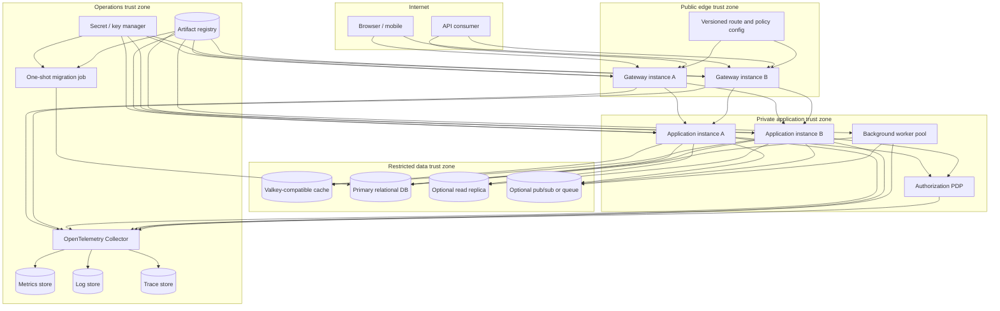

### 7.1 Trust boundaries

| Boundary | Permitted traffic | Required controls |
|---|---|---|
| Internet → edge | Public HTTP(S), WebSocket over TLS | TLS, request/header/body limits, DDoS controls, route allowlist, origin policy, rate limits |
| Edge → application | Proxied application traffic | Auth context integrity, mTLS or protected network where risk requires it, timeouts, retry budget, request IDs |
| Application → policy | Structured authorization input | Authenticated caller, policy bundle version, decision logging without sensitive payload leakage |
| Application → cache | Cache and rate-limit operations | Private network, authentication, key namespace isolation, bounded TTL, connection limits |
| Application → database | Parameterized SQL through least-privileged role | TLS where supported, role separation, statement timeout, transaction limits, audit controls |
| Migration runner → database | Schema and controlled data changes | Exclusive deployment identity, migration lock, checksum verification, explicit destructive approval |
| Workloads → secrets | Runtime secret retrieval | Workload identity, least privilege, rotation, no broad environment inheritance |
| Workloads → telemetry | Structured telemetry only | Redaction, bounded cardinality, backpressure, non-blocking low-risk failure mode |

---

## 8. End-to-end request flows

### 8.1 Authenticated HTTP request

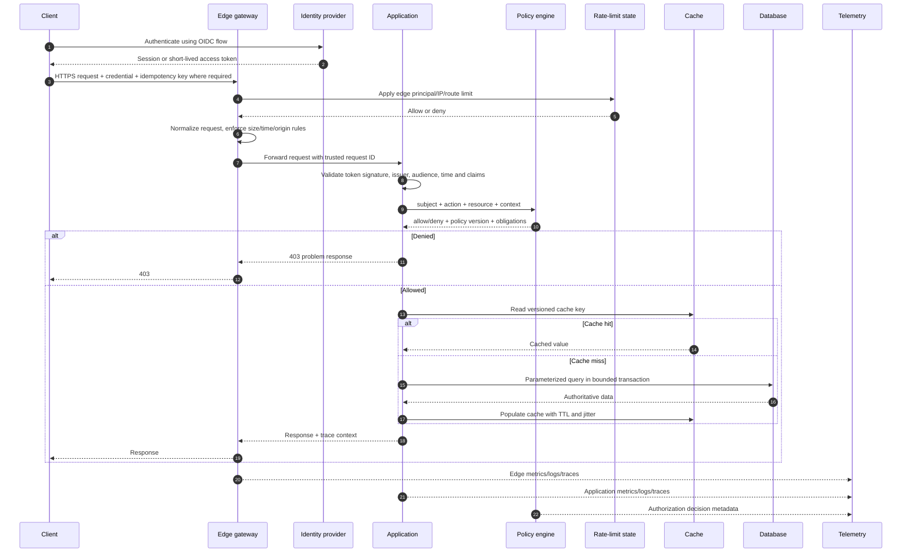

### 8.2 WebSocket lifecycle

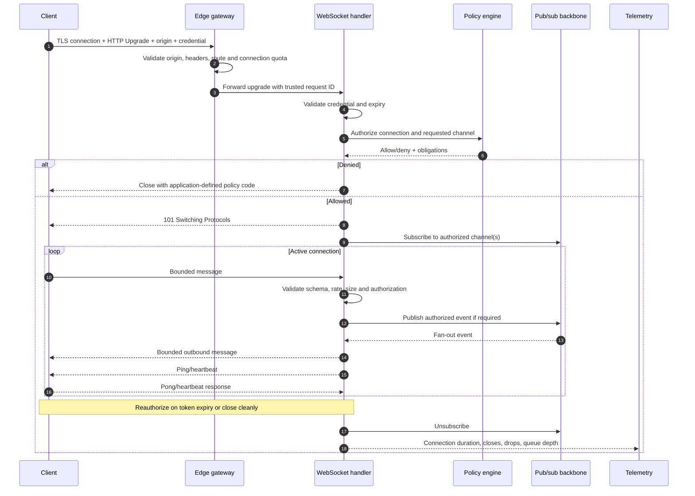

### 8.3 Required invariants across both flows

- The edge may validate credentials for early rejection, but the application remains responsible for authoritative authentication and authorization at its trust boundary.
- Request IDs received from untrusted clients are replaced or namespaced; trusted correlation IDs are propagated downstream.
- All request, connection, query, and downstream calls have explicit time and size bounds.
- Retries are attempted only when the operation is safe or protected by an idempotency mechanism.
- Authorization is repeated when the resource or action changes; connection authorization does not authorize every future WebSocket message.
- Sensitive claims, access tokens, cookies, SQL parameters, and secret values are excluded from ordinary logs and traces.

---

## 9. Backend architecture

### 9.1 API contract architecture

The API contract is the boundary between independently changing systems. It MUST be reviewable and testable without reading implementation code.

#### Contract requirements

- Use a machine-readable OpenAPI contract for HTTP APIs. OpenAPI 3.2.0 is the latest stable specification at this review date; where ecosystem tooling has not yet caught up, pin a compatible 3.1.x revision and record the compatibility decision in an ADR.
- Keep the contract in version control and validate it in CI.
- Define request and response schemas, required headers, authentication, status codes, pagination, rate-limit behavior, idempotency, and error responses.
- Generate clients or server interfaces only where generated code remains subordinate to the reviewed contract.
- Detect breaking changes before merge.
- Publish the exact contract revision deployed with each application artifact.
- Treat undocumented endpoints and undocumented response fields as defects.

#### Versioning rule

Prefer additive, backward-compatible evolution within a stable API version. Introduce a new major version only for behavior that cannot coexist safely. Deprecation requires:

1. an announced removal date;
2. usage telemetry by client/version;
3. a migration guide;
4. a compatibility test;
5. a removal gate proving dependent traffic has ended or an owner has accepted the break.

#### HTTP method and retry semantics

| Operation | Expected property | Retry rule |
|---|---|---|
| GET / HEAD | Safe and idempotent | Retry only inside a bounded budget and only for classified transient failures |
| PUT / DELETE | Idempotent by contract | Retry when downstream state and client semantics preserve idempotence |
| POST mutation | Non-idempotent by default | Require an idempotency key for client-visible retriable operations |
| PATCH | Depends on patch semantics | Declare whether replay is safe; otherwise do not retry automatically |

An idempotency record SHOULD bind the key to principal, route, normalized request hash, result state, and expiration. Reuse with a different payload MUST be rejected.

#### Standard error contract

Use a stable machine-readable envelope aligned with HTTP Problem Details semantics:

```json
{
  "type": "https://errors.example.invalid/validation",
  "title": "Request validation failed",
  "status": 400,
  "code": "VALIDATION_ERROR",
  "detail": "One or more fields are invalid.",
  "trace_id": "01J4N8Q1G6AT6E6K4R3P9P2X7Y",
  "errors": [
    {
      "field": "email",
      "reason": "INVALID_FORMAT"
    }
  ]
}
```

Rules:

- `code` is stable for automation; prose is not.
- Internal exceptions, SQL fragments, stack traces, filesystem paths, and secret-adjacent values never cross the public boundary.
- A trace identifier may be returned; a raw infrastructure identifier should not be.
- Validation failures are distinguished from authentication, authorization, conflict, throttling, and dependency failure.

#### Input validation

Validation occurs at every trust boundary:

- schema and type;
- length and collection size;
- allowed character set where domain-appropriate;
- numeric and date ranges;
- enumerated state transitions;
- content type;
- decompressed body size;
- file type verified by content, not filename alone;
- business invariants after structural validation.

Validation libraries reduce boilerplate but do not replace domain rules.

### 9.2 API runtime topology

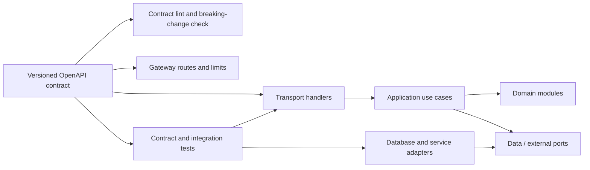

Transport handlers MUST remain thin. They parse protocol input, call an application use case, and translate the result. They MUST NOT own durable business rules, raw SQL construction, or ad hoc authorization policy.

### 9.3 WebSocket architecture

WebSockets are long-lived stateful connections running on otherwise stateless application infrastructure. They require controls that ordinary HTTP endpoints do not.

| Concern | Required design |
|---|---|
| Handshake authentication | Validate credential at upgrade; do not place durable bearer secrets in query strings where logs can capture them |
| Origin | Validate browser origins explicitly; non-browser clients require their own authentication policy |
| Authorization | Authorize connection, channel subscription, and message action separately |
| Token expiry | Reauthenticate, refresh through a separate secure flow, or close at expiry |
| Backpressure | Bound per-connection and global outbound queues; shed or disconnect slow consumers |
| Heartbeats | Use ping/pong or application heartbeat with idle and dead-peer timeouts |
| Message schema | Version and validate every client message before execution |
| Size limits | Limit frame, message, decompressed payload, and aggregate batch size |
| Rate limits | Apply connection creation, inbound message, subscription, and expensive-action limits |
| Horizontal scale | Use external pub/sub or routing state; never assume all subscribers share one process |
| Draining | Stop new upgrades, notify or close existing connections, and honor a bounded drain window |
| Reconnect storm | Exponential backoff with jitter, server retry hints, and admission control |
| Delivery semantics | Declare at-most-once, at-least-once, ordering, deduplication, and resume behavior |

A WebSocket connection MUST NOT be used merely to avoid designing an HTTP API. Use it when bidirectional low-latency delivery or server-initiated updates are actual requirements.

### 9.4 Reverse proxy architecture

The reverse proxy is a controlled protocol and traffic boundary. It owns:

- TLS termination or passthrough according to the trust model;
- HTTP/1.1, HTTP/2, and where supported HTTP/3 negotiation;
- WebSocket upgrade forwarding;
- route matching and backend selection;
- load balancing and outlier handling;
- request and response header normalization;
- body, header, URL, and timeout limits;
- trusted client address derivation;
- request ID creation;
- CORS preflight processing when policy is centralized;
- coarse authentication rejection where appropriate;
- local and global rate-limit integration;
- connection draining and graceful reload;
- access telemetry with redaction.

It does not own:

- final business authorization;
- domain validation;
- durable application state;
- arbitrary response caching without an explicit cache contract;
- unrestricted request retries;
- secret-bearing debug logs.

#### Required timeout budget

Timeouts MUST decrease as a request moves inward. A practical model is:

```text
client deadline
  > edge request timeout
    > application use-case timeout
      > aggregate downstream budget
        > individual database or service attempt timeout
```

The outer layer must retain enough time to translate errors, emit telemetry, and close cleanly. A retry consumes the same total budget; it does not reset it.

---

## 10. Identity and access management

### 10.1 IAM component model

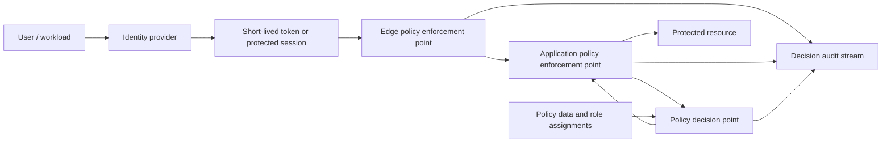

### 10.2 Authentication

Use a standards-based identity provider for interactive and workload identity. The preferred browser flow is Authorization Code with PKCE. High-risk applications SHOULD support phishing-resistant MFA where the identity platform and user population allow it.

Session choices:

| Client type | Preferred credential boundary |
|---|---|
| Browser application with same-party backend | Backend-for-frontend or server session in `HttpOnly`, `Secure`, appropriately scoped `SameSite` cookie |
| Native mobile/desktop | System browser authorization flow with PKCE and protected platform credential storage |
| Machine-to-machine | Workload identity or narrowly scoped client credentials; avoid long-lived static bearer tokens |
| Third-party API consumer | OAuth client with explicit scopes, rotation, revocation, quotas, and auditability |

Browser access tokens SHOULD NOT be placed in persistent JavaScript-readable storage when a protected server-side session or backend-for-frontend design is feasible.

### 10.3 JWT architecture

JWT is a signed or encrypted token format. It is not a complete IAM architecture.

Every JWT verifier MUST enforce:

- expected token type and use;
- algorithm allowlist; never accept an algorithm merely because the token header requests it;
- signature verification with trusted keys;
- issuer match;
- audience match;
- expiration and not-before validation with a small documented clock skew;
- key identifier handling through a trusted JWKS source or pinned key set;
- key rotation and cache-expiry behavior;
- required subject or client identity;
- scope or claim shape validation;
- maximum token age where required;
- rejection of malformed, oversized, nested, or unsupported tokens.

JWT claims SHOULD contain stable identifiers and coarse authorization context, not volatile entitlements or sensitive personal data. Dynamic authorization is evaluated against current policy data. A token that was valid at issuance may no longer authorize an action after role removal, tenant suspension, or resource-state change.

Recommended token properties:

- short-lived access tokens;
- separate refresh-token boundary with rotation and reuse detection where supported;
- asymmetric signatures for distributed verification;
- explicit `kid` rotation strategy;
- revocation or session termination mechanism for high-risk operations;
- no secrets, credentials, payment data, or unnecessary personal data in claims.

### 10.4 RBAC and ABAC

RBAC grants permissions through roles. ABAC evaluates attributes of the subject, action, resource, and environment. They SHOULD be combined rather than treated as competitors:

- RBAC supplies stable coarse-grained grants such as `support_agent`, `billing_admin`, or `project_editor`.
- ABAC applies contextual restrictions such as tenant, ownership, region, resource state, risk score, time window, device assurance, or data classification.

#### Canonical authorization input

```json
{
  "subject": {
    "id": "user_123",
    "type": "human",
    "roles": ["project_editor"],
    "tenant_id": "tenant_456",
    "assurance": "mfa"
  },
  "action": "project.update",
  "resource": {
    "type": "project",
    "id": "project_789",
    "tenant_id": "tenant_456",
    "owner_id": "user_123",
    "classification": "internal",
    "state": "active"
  },
  "context": {
    "request_time": "2026-08-05T09:00:00Z",
    "source_network": "trusted",
    "risk": "low"
  }
}
```

Canonical decision:

```json
{
  "allow": true,
  "policy_version": "policy-bundle-2026-08-05.1",
  "reason_code": "ROLE_AND_RESOURCE_SCOPE_MATCH",
  "obligations": {
    "redact_fields": [],
    "require_step_up": false
  }
}
```

#### Policy rules

- Deny by default.
- Policies are version-controlled, tested, reviewed, and promoted like code.
- The application maps domain actions to policy actions in one authoritative location.
- Tenant or account boundaries are enforced in authorization and data access, not only in UI filtering.
- Policy decisions are cached only when the key includes all decision-relevant attributes and the TTL is safely bounded.
- Emergency access is time-bound, separately approved, strongly authenticated, and fully audited.
- Administrative roles are not ordinary application roles; they use distinct permission and audit boundaries.

### 10.5 Policy enforcement placement

| Enforcement point | Purpose | Limitation |
|---|---|---|
| Edge | Reject obviously invalid or unauthorized routes early | Lacks complete resource state; cannot be sole enforcement point |
| Application use case | Authoritative action-level decision | Must remain consistent across all transports and workers |
| Data access | Tenant/row constraints and least-privileged database role | Cannot express all business authorization alone |
| Background worker | Revalidate authority or execute under a narrowly scoped service identity | Must not trust stale user context indefinitely |

---

## 11. Application security

### 11.1 TLS and certificate lifecycle

TLS 1.3 is the default protocol. TLS 1.2 may be enabled for documented compatibility. Older SSL/TLS protocol versions are disabled.

Required controls:

- redirect plaintext browser traffic to HTTPS where a plaintext listener exists;
- do not expose plaintext alternatives for API-only services unless an upstream trusted boundary terminates TLS by design;
- enable HSTS after verifying all required subdomains and rollback implications;
- automate certificate issuance, renewal, and expiry monitoring;
- protect private keys through a secret manager, workload identity, or platform key service;
- use secure session-cookie attributes;
- test certificate-chain, hostname, protocol, and cipher configuration;
- prefer mTLS for high-value service-to-service or administrative boundaries when network isolation alone is insufficient;
- alert well before certificate expiration and test renewal failure handling;
- rotate keys after suspected exposure, not merely certificates.

TLS termination options:

| Pattern | Use | Required condition |
|---|---|---|
| Terminate at edge; protected private network inward | General managed-cloud and container deployments | Network policy and workload identity make the inner path trusted enough for the risk |
| Terminate at edge and re-encrypt to application | Higher-risk private networks or shared infrastructure | Certificate automation and identity verification between edge and workload |
| End-to-end passthrough | Application-owned protocol/security boundary | Application can operate certificates, load balancing, telemetry, and rotation safely |

### 11.2 CORS

CORS controls whether a browser exposes a cross-origin response to JavaScript. It does not authenticate a caller, prevent direct API calls, or replace CSRF protection.

Required policy:

- maintain an explicit origin allowlist;
- never reflect arbitrary `Origin` values;
- do not combine credentialed requests with wildcard origins;
- allow only required methods and headers;
- minimize exposed response headers;
- return `Vary: Origin` when responses vary by origin;
- bound preflight cache duration so policy changes propagate;
- reject opaque `null` origins unless a documented use case requires them;
- test allowed, denied, malformed, subdomain-confusion, port, scheme, and preflight cases;
- keep development origins out of production configuration.

Example policy object:

```yaml
cors:
  allowed_origins:
    - https://app.example.invalid
  allowed_methods: [GET, POST, PUT, PATCH, DELETE, OPTIONS]
  allowed_headers: [Authorization, Content-Type, Idempotency-Key, Traceparent]
  exposed_headers: [RateLimit-Limit, RateLimit-Remaining, RateLimit-Reset]
  allow_credentials: true
  max_age_seconds: 600
```

### 11.3 SQL-injection prevention

The primary control is parameterized data access. String escaping and input filtering are not acceptable primary defenses.

Mandatory rules:

- use prepared statements or a query builder/ORM that binds values;
- never concatenate untrusted values into SQL;
- allowlist dynamic table, column, direction, or operator identifiers when they cannot be parameterized;
- isolate raw-query APIs behind a narrow reviewed module;
- use separate database roles for application runtime, migrations, reporting, and administration;
- grant the runtime only required schema/object privileges;
- avoid database-owner or superuser credentials in the application;
- apply statement, lock, and transaction timeouts;
- return generic errors to clients while preserving redacted diagnostics internally;
- test injection payloads against every raw-query and dynamic-filter surface;
- review stored procedures for dynamic SQL; stored procedures are not inherently safe.

Safe pattern:

```text
SQL template: SELECT id, status FROM orders WHERE tenant_id = $1 AND id = $2
Bound values: [tenant_id, order_id]
```

Unsafe pattern:

```text
"SELECT ... WHERE tenant_id = '" + tenantId + "'"
```

### 11.4 Rate limiting

Rate limiting protects availability, fairness, cost, and abuse boundaries. It is not a replacement for capacity planning or authorization.

#### Two-level architecture

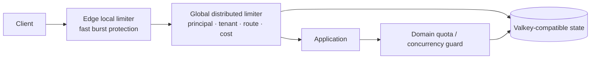

Required dimensions SHOULD include the smallest applicable set of:

- source IP or network;
- authenticated principal;
- client/application ID;
- tenant or account;
- route and HTTP method;
- operation cost class;
- concurrent operations;
- connection creations;
- WebSocket messages or subscriptions;
- daily/monthly product quota.

Recommended behavior:

- token bucket for bounded bursts;
- sliding or fixed windows where accounting semantics require them;
- concurrency limits for expensive or long-running work;
- standardized `429` response with retry guidance;
- rate-limit response headers where exposing them does not aid abuse;
- separate anonymous and authenticated policies;
- no dependence on user-controlled forwarding headers;
- cardinality and memory limits for limiter keys;
- policy versioning and auditability;
- load tests that prove the limiter itself does not become the bottleneck.

#### Limiter dependency failure policy

| Route class | Default on distributed limiter outage |
|---|---|
| Authentication, password reset, money movement, destructive administration | Fail closed or enter a tightly bounded emergency mode |
| Expensive AI, export, report, or third-party-cost operation | Fail closed or enforce conservative local limits |
| Ordinary authenticated read | Apply local limits and degrade cautiously if business risk permits |
| Health check | Do not depend on the distributed limiter |
| Telemetry intake | Shed or sample according to capacity; do not destabilize core traffic |

### 11.5 Required adjacent security controls

The original category list is necessary but not sufficient. A production baseline also requires:

- secret and key management;
- dependency and image vulnerability scanning;
- source secret scanning;
- signed build provenance and artifacts;
- CSRF controls for cookie-authenticated mutations;
- output encoding and content security policy for browser surfaces;
- SSRF controls for server-side URL retrieval;
- file-upload isolation and malware policy where uploads exist;
- security event audit trails;
- threat modeling for new trust boundaries;
- incident response and credential-rotation procedures.

---

## 12. Performance and scalability

### 12.1 Capacity model

Capacity planning begins with a workload model, not a replica count.

Record at minimum:

- requests per second by route and method;
- concurrent requests and connections;
- WebSocket connection count and message rate;
- payload and response-size distributions;
- read/write ratio;
- cacheable read fraction and expected hit rate;
- database query rate and transaction duration;
- third-party call rate and latency;
- background-job arrival and service rate;
- peak-to-average ratio;
- growth forecast and failure headroom.

Load tests MUST use representative route mix, data distribution, authentication, cache state, connection duration, and dependency behavior. A single hot endpoint with synthetic zero-latency dependencies is not capacity evidence.

### 12.2 Caching architecture

Default pattern: **cache-aside**.

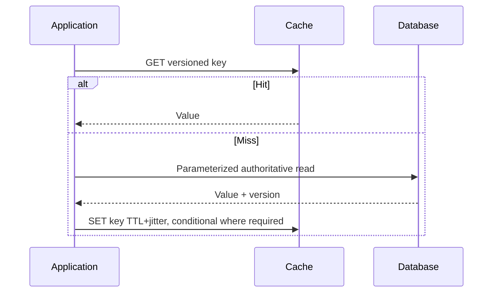

Cache key requirements:

```text
<environment>:<schema-version>:<tenant-or-scope>:<resource-type>:<resource-id>:<representation-version>
```

Required controls:

- bounded TTL with jitter to avoid synchronized expiry;
- explicit namespace and representation version;
- tenant or authorization scope in the key when responses differ by scope;
- stampede protection through request coalescing, leases, or probabilistic early refresh;
- maximum value and key size;
- negative caching only for safe, short-lived cases;
- invalidation tied to committed authoritative changes;
- no secrets, access tokens, or unrestricted sensitive payloads;
- metrics for hit ratio, miss latency, evictions, memory, stale serves, and connection saturation;
- a tested cache-outage mode;
- no correctness dependency on cache availability unless the cache is explicitly promoted to a durable system with a different design.

Cache patterns by need:

| Need | Pattern | Caveat |
|---|---|---|
| Read acceleration | Cache-aside | Staleness and invalidation must be defined |
| Computed expensive result | Materialized cache with versioned inputs | Include every result-affecting input in the key |
| Session state | Central session store | Requires high availability and secure expiration/revocation |
| Rate-limit counters | Atomic distributed counters/scripts | Define consistency and outage behavior |
| WebSocket fan-out | Pub/sub or streams | Pub/sub alone may not provide durable replay |

### 12.3 Load balancing

Stateless HTTP workloads SHOULD use health-aware least-request, round-robin, or equivalent balancing. Hash-based affinity is justified only by a specific locality or state requirement.

Required controls:

- startup, readiness, and liveness semantics are distinct;
- readiness fails before shutdown so new traffic stops;
- connection draining has a bounded grace period;
- unhealthy or outlier instances are removed without synchronized ejection of the entire fleet;
- zone-aware routing preserves locality while retaining cross-zone failover;
- retry budgets prevent amplification;
- WebSocket balancing accounts for long-lived connections and connection count, not only request rate;
- sticky sessions are avoided unless legacy state cannot yet be externalized;
- backend TLS identity is verified when re-encryption is used;
- canary traffic is isolated and observable.

#### Health endpoint semantics

| Endpoint | Purpose | Dependencies |
|---|---|---|
| Startup | Process completed required initialization | May include mandatory local initialization; not every remote dependency |
| Readiness | Instance can accept new traffic | Include only dependencies whose failure makes serving unsafe or impossible |
| Liveness | Process is irrecoverably unhealthy and restart may help | Must not fail for ordinary downstream outages |
| Deep diagnostic | Operator investigation | Authenticated/private; may inspect dependencies; never used as a public liveness check |

### 12.4 Database indexing

Indexing is workload engineering. More indexes can reduce write throughput, increase storage, extend vacuum/maintenance work, and make migrations riskier.

#### Index workflow

1. Capture a real slow or high-frequency query with normalized parameters.
2. Record execution frequency, p50/p95/p99 latency, rows examined/returned, locks, and I/O.
3. Inspect the execution plan with representative statistics and data volume.
4. Test a hypothetical index where supported.
5. Validate selectivity, column order, predicate, included columns, and write cost.
6. Create the index online/concurrently when the database supports it.
7. Monitor build duration, locks, replication lag, disk, and application latency.
8. Verify the new plan and end-user metric.
9. Reassess after data-distribution or query-shape changes.
10. Remove duplicate or unused indexes only after an observation window and rollback plan.

General guidance:

- B-tree is the default for equality, range, and ordering workloads.
- Composite index column order follows actual equality/range/order predicates, not table column order.
- Partial indexes reduce size and write cost for stable selective predicates.
- Covering/index-included columns can avoid heap access but increase index size.
- Specialized index types are selected for the actual operator class and query.
- Foreign-key lookup and delete/update paths are reviewed explicitly.
- Index names, ownership, purpose, and source query are documented in the migration.

### 12.5 Scalability thresholds

Scaling actions SHOULD be triggered by sustained evidence, not one spike:

| Signal | Scale or remediation action |
|---|---|
| CPU saturation with healthy dependencies | Horizontal compute scale; profile hot paths before vertical escalation |
| Queue wait rising faster than service time | Add workers, constrain admission, or reduce job cost |
| Database connection saturation | Pool correctly, reduce transaction duration, then scale database architecture |
| Slow query I/O | Query/index/data-layout remediation before adding replicas |
| Cache evictions and low hit rate | Fix key/TTL/value policy before adding memory |
| WebSocket event-loop or connection saturation | Partition connection handlers and use external fan-out |
| Third-party latency dominates | Bound, cache safe results, use asynchronous workflow, or degrade functionality |
| One tenant dominates capacity | Tenant quotas, isolation, and cost-aware scheduling |

---

## 13. Data lifecycle

### 13.1 Database migration architecture

Migrations are deployable artifacts with their own identity, permissions, locks, evidence, and rollback decision. They MUST NOT be an uncontrolled side effect of every application process starting.


#### Expand–migrate–contract protocol

1. **Expand:** Add nullable columns, new tables, new indexes, or compatible structures. Do not remove old behavior.
2. **Deploy compatible code:** New code can operate while old and new schema versions coexist.
3. **Backfill:** Process bounded chunks with checkpoints, rate limits, cancellation, and idempotence.
4. **Cut over:** Change reads/writes behind a measured flag or controlled release.
5. **Observe:** Prove old readers/writers are gone and data is consistent.
6. **Contract:** Remove deprecated structures in a separately approved migration.

#### Migration controls

- one authoritative migration ledger;
- immutable checksums after release;
- exclusive or advisory migration lock;
- separate migration database role;
- lock and statement timeout;
- transaction boundaries appropriate to the database operation;
- online/concurrent index creation where supported;
- preflight disk-space and replication-lag checks;
- N/N-1 application compatibility during rollout;
- backup and restore-point evidence before destructive work;
- deterministic post-migration assertions;
- explicit owner approval for destructive or irreversible changes;
- forward-fix by default after production rollout; rollback only when data semantics are proven safe.

A down migration is not automatically a valid rollback. Once new code has written data using the new schema, reverting schema may destroy or misinterpret that data.

### 13.2 Data migrations and backfills

A production backfill MUST be:

- idempotent;
- resumable from a durable checkpoint;
- bounded by rows, bytes, or time per batch;
- rate-limited against database load and replication lag;
- observable by progress, error, retry, and estimated remaining work;
- safe under concurrent application writes;
- reversible or compensatable when practical;
- separately deployable from request-serving code when it is long-running.

### 13.3 Backup, restore, and retention

Backups are not verified until restored.

Required program:

- automated encrypted backups;
- point-in-time recovery where the platform supports it;
- documented retention and deletion policy;
- cross-account or equivalent isolation for high-value systems;
- regular restore drills into an isolated environment;
- checksum or consistency validation after restore;
- measured RPO and RTO from the drill, not vendor marketing;
- restoration of application configuration, keys, object data, and dependencies—not only the primary database;
- legal hold and deletion workflows where applicable.

### 13.4 Data ownership

Each mutable data set has one authoritative owner. Other modules or services access it through a contract or controlled read model. Shared tables with unbounded cross-module writes are prohibited because they defeat authorization, migration ownership, and change isolation.

For multi-tenant applications, tenant identity MUST be enforced in:

- authorization input;
- database query predicates or row-security policy;
- unique constraints where uniqueness is tenant-scoped;
- cache keys;
- event routing;
- object-storage prefixes and policies;
- logs and metrics without creating unbounded cardinality.

---

## 14. Infrastructure and DevOps

### 14.1 Container build architecture

Containers are immutable release artifacts, not portable copies of the repository.

Required build properties:

- multi-stage build;
- BuildKit-compatible deterministic build graph;
- explicit `COPY` allowlists rather than indiscriminate repository copying;
- strict `.dockerignore` covering source-only material, tests not required at runtime, local credentials, VCS data, documentation, fixtures, uploads, editor files, and agent/operator context;
- dependency lockfile enforcement;
- pinned base image by immutable digest for released artifacts;
- minimal runtime image;
- non-root user;
- read-only root filesystem where the runtime permits it;
- explicit writable temporary and data mounts;
- dropped Linux capabilities and no privilege escalation;
- no package manager, compiler, VCS client, or shell in the final image unless runtime evidence requires it;
- no build secret persisted in layers, history, labels, or environment;
- reproducible application version and source revision labels;
- SBOM generation;
- vulnerability and misconfiguration scan;
- artifact signature and provenance;
- registry retention and revocation policy.

Illustrative build graph:

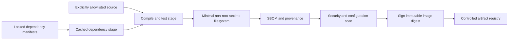

The concrete base-image digests, entry point, runtime user, and copied paths are selected and verified in the adopting repository. The architecture deliberately does not invent those repository-specific values.

#### Runtime controls

- set CPU, memory, process, file-descriptor, and ephemeral-storage limits;
- handle termination signals and stop accepting traffic before exit;
- use orchestrator health probes rather than assuming process existence equals health;
- mount secrets at runtime or retrieve them through workload identity;
- avoid broad environment inheritance into child processes;
- set a restrictive default umask;
- use seccomp/AppArmor/SELinux or equivalent platform confinement where available;
- record the exact running image digest in telemetry and deployment evidence.

### 14.2 Configuration and secret architecture

Configuration is classified into:

| Class | Examples | Storage and change rule |
|---|---|---|
| Public build configuration | feature compilation mode, public asset base | Version-controlled and built into artifact where appropriate |
| Runtime non-secret configuration | timeouts, feature flags, route limits | Versioned configuration system; validated at startup |
| Secrets | private keys, DB credentials, API secrets | Secret manager or workload identity; never committed or baked into images |
| Dynamic policy | role mappings, rate limits, authorization rules | Versioned, authenticated distribution with rollback and audit |

A process receives only the configuration and secrets it requires. Child processes receive an explicit allowlist, never an unrestricted copy of the parent environment.

Required secret lifecycle:

1. create under least privilege;
2. distribute through workload identity or narrow secret binding;
3. prevent ordinary logging and tracing;
4. rotate without rebuilding application code where feasible;
5. support overlap during rotation;
6. revoke and audit;
7. test emergency rotation;
8. scan source, history, artifacts, logs, and images after suspected exposure.

### 14.3 CI/CD and supply-chain pipeline


#### Pipeline laws

- Pull requests cannot write to production.
- Untrusted fork code does not receive privileged secrets.
- Build and deployment identities are separate.
- Production deployment requires an immutable digest, not a mutable tag alone.
- The same digest is promoted through environments.
- Migration identity is separate from request-serving identity.
- A scan exception has an owner, scope, rationale, expiry, and compensating control.
- The release record includes source revision, build run, digest, SBOM, signature, scan result, contract revision, migration revision, deploy actor, rollout state, and verification result.
- Production rollback does not silently reverse destructive data changes.

### 14.4 Environment and release strategy

Environment configuration may differ; application bytes do not.

Preferred rollout order:

1. pre-production integration environment;
2. production migration expand phase where required;
3. canary instance or low-percentage traffic slice;
4. automated smoke and synthetic checks;
5. SLI comparison against baseline;
6. progressive traffic increase;
7. full promotion;
8. bounded observation window;
9. contract/deprecation cleanup in a later release.

A canary MUST be distinguishable in metrics, logs, and traces. Aggregate health can hide a canary regression.

### 14.5 Reverse proxy and load-balancer deployment

For simple deployments, a Caddy- or Traefik-class edge can combine automatic certificate management, reverse proxying, and load balancing. For higher-control or higher-scale deployments, an Envoy-class data plane with versioned configuration and a separate control plane is preferred. In Kubernetes environments, Gateway API provides a role-oriented routing contract; the selected controller supplies the actual data plane.

The architecture depends on capabilities, not brands:

- atomic or graceful configuration reload;
- health-aware endpoint discovery;
- TLS automation;
- WebSocket support;
- request/connection limits;
- local and distributed rate limiting;
- structured access telemetry;
- outlier detection;
- timeout and retry policy;
- zone and canary routing;
- secure administrative interface.

The proxy administration interface MUST be private, authenticated where supported, and inaccessible from ordinary application traffic.

### 14.6 Orchestration choice

| Runtime | Choose when | Avoid when |
|---|---|---|
| Managed application/container platform | Team needs autoscaling, TLS, deployment, and logs without operating a cluster | Platform cannot satisfy networking, security, workload, or portability requirements |
| Docker Compose or equivalent | Development, integration, small controlled single-host deployment | High availability or automatic rescheduling is required |
| Kubernetes | Multiple services/workloads require portable orchestration, policy, progressive delivery, and operational staffing exists | A single application can be operated more safely on a simpler platform |
| Serverless functions | Bursty stateless event/request workloads with bounded duration and platform-compatible state model | Long-lived WebSockets, specialized networking, predictable sustained compute, or deep runtime control dominates |

Kubernetes is not a production-readiness synonym. A poorly operated cluster increases risk.

---

## 15. Observability and operational control

### 15.1 Telemetry architecture

Use OpenTelemetry-compatible instrumentation and a collector layer so application code is not tightly coupled to one telemetry vendor.

Required telemetry:

- structured application and access logs;
- request, error, duration, and saturation metrics;
- distributed traces across edge, application, policy, cache, database, and external calls;
- deployment revision, image digest, region/zone, and canary dimension;
- authorization allow/deny count by stable reason code;
- rate-limit decisions and limiter health;
- cache hit/miss/eviction/staleness;
- database pool, query latency, locks, replication lag, and storage;
- WebSocket active connections, connection churn, message rate, dropped messages, and queue depth;
- migration state and backfill progress;
- certificate expiry and renewal state.

### 15.2 Cardinality and privacy

Telemetry fields MUST be classified. Avoid unbounded identifiers in metric labels. User, request, order, session, token, SQL value, and full URL query data belong in controlled logs or traces only when necessary and redacted—not in high-cardinality metrics.

Required redaction covers:

- authorization headers;
- cookies;
- access and refresh tokens;
- passwords and one-time codes;
- database connection strings;
- private keys and API secrets;
- payment and regulated data;
- raw request bodies by default;
- sensitive URL query parameters.

### 15.3 SLI model

Core service indicators:

| SLI | Definition |
|---|---|
| Availability | Valid requests served successfully divided by valid requests, excluding explicitly classified client errors |
| Latency | Distribution of end-to-end latency for successful and separately for failed requests |
| Correctness | Domain-specific successful outcomes, not merely HTTP 2xx |
| Freshness | Age of data or events where timeliness matters |
| Durability | Confirmed writes retained and recoverable |
| WebSocket delivery | Connection success, event delivery delay, disconnect and drop rate |
| Migration safety | Migration completion, lock impact, error count, compatibility checks |

SLO alerts SHOULD use burn-rate logic across short and long windows rather than paging on every transient threshold crossing.

### 15.4 Health, alerts, and runbooks

Every page-worthy alert has:

- a user or data impact statement;
- a stable owner;
- a runbook;
- relevant dashboards and traces;
- an immediate containment action;
- an escalation path;
- a test proving it can fire;
- a review cadence to remove noisy or obsolete alerts.

Do not page on conditions that require no immediate human action.

---

## 16. Resilience and failure architecture

### 16.1 Resilience primitives

- **Timeouts:** Every network and database operation has an explicit deadline.
- **Retries:** Only classified transient failures; bounded attempts; exponential backoff with jitter; shared retry budget.
- **Circuit breaking:** Protects saturated or failing dependencies; transitions are observable.
- **Bulkheads:** Separate pools/queues for workloads with different cost or criticality.
- **Admission control:** Reject work before overload produces total collapse.
- **Idempotency:** Protects replayed mutations and background jobs.
- **Graceful degradation:** Preserve core functions while disabling non-critical dependencies.
- **Load shedding:** Drop lowest-priority work first under saturation.
- **Graceful shutdown:** Stop admission, drain, checkpoint, close, then terminate.
- **Chaos and recovery exercises:** Validate assumptions in controlled environments.

### 16.2 Failure-mode matrix

| Failure | Required behavior | Verification |
|---|---|---|
| Identity provider unavailable | Existing valid sessions follow documented risk window; new authentication fails clearly; privileged step-up fails closed | Dependency fault test and session-expiry test |
| JWKS endpoint unavailable | Use bounded previously validated key cache; unknown key IDs fail closed | Key-rotation and cache-expiry tests |
| Policy engine unavailable | High-risk mutations fail closed; explicitly classified low-risk reads may use a short bounded decision cache | Policy outage integration test |
| Distributed rate-limit store unavailable | Apply route-class failure policy and conservative local limits | Limiter dependency fault test |
| Cache unavailable | Bypass with database protection, concurrency cap, and load shedding; no correctness loss | Cache blackhole and cold-start load test |
| Database unavailable | Stop unsafe writes, bound pools/retries, surface stable error, preserve idempotency state where possible | Failover and connection-exhaustion test |
| Database replica stale | Route consistency-sensitive reads to primary or enforce bounded staleness | Replica-lag test |
| Migration blocked | Abort on lock/statement timeout; do not leave ambiguous partial state | Representative-scale migration test |
| Telemetry backend unavailable | Buffer only within bounds; sample/drop without blocking core request path | Collector/backend outage test |
| Certificate renewal fails | Alert before expiry; retain valid existing certificate; execute documented emergency rotation | Renewal simulation |
| One availability zone fails | Remove endpoints, preserve capacity headroom, verify data dependency behavior | Zone-failure exercise |
| WebSocket node drains | Stop upgrades, notify/close within drain window, clients reconnect with jitter | Rolling deployment test |
| Pub/sub fails | Declare loss/delay semantics; buffer or degrade according to contract | Broker outage and replay test |
| Deployment regression | Halt progression and redirect traffic to known-good digest | Automated canary rollback test |
| Secret rotation | Old/new overlap works; old credential revoked after cutover | Rotation exercise |

### 16.3 Dependency budget

An application's availability cannot exceed the combined behavior of its critical dependencies. Classify each dependency:

| Class | Definition | Design response |
|---|---|---|
| Hard synchronous | Request cannot succeed safely without it | Redundancy, strict timeout, bounded retry, circuit breaker, SLO ownership |
| Soft synchronous | Feature may degrade without it | Fallback, cached result, omission, or delayed completion |
| Asynchronous durable | Work can be accepted and completed later | Durable queue, idempotent worker, dead-letter/recovery process |
| Best-effort | Loss is acceptable within documented limits | Bounded buffer, sampling, no request-path blocking |

---

## 17. Deployment profiles

### 17.1 Profile A — standard single-region application

Use for most new production applications.

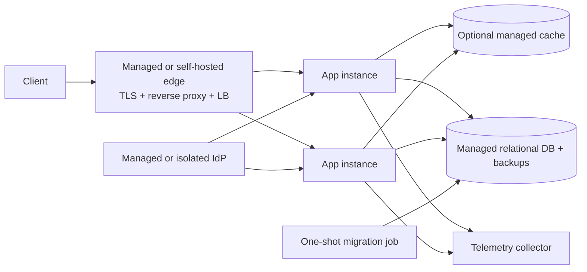

Properties:

- at least two stateless application instances where the SLO requires high availability;
- managed database with backup/PITR capability;
- optional managed cache;
- external identity provider;
- automatic TLS;
- progressive deployments;
- no cluster operation unless justified.

### 17.2 Profile B — scaled container platform

Use when service count, traffic, policy, or workload variety justifies orchestration.

- Kubernetes Gateway API or equivalent routing contract;
- Envoy-, Caddy-, or Traefik-class gateway/controller according to control needs;
- cert-manager-class certificate automation;
- stateless workload replicas across failure domains;
- external policy engine where shared policy is required;
- distributed Valkey-compatible cache/rate-limit state;
- high-availability relational database architecture;
- one migration job per release;
- OpenTelemetry Collector deployment with bounded buffering;
- network policies, workload identity, admission policy, signed image verification;
- progressive delivery and automated SLO analysis.

### 17.3 Profile C — critical multi-region cellular architecture

Use only when regional failure, data residency, or global latency requirements justify the cost.

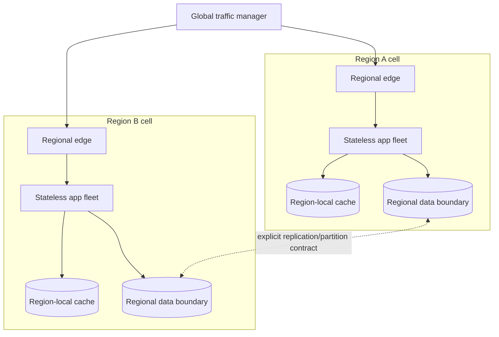

Required decisions before adoption:

- active/active versus active/passive;
- authoritative write region or conflict-resolution model;
- tenant or data partitioning;
- replication lag and consistency contract;
- failover trigger and authority;
- global identity and policy behavior;
- cache locality;
- regional secret and certificate lifecycle;
- backup independence;
- tested failback, not only failover.

Multi-region compute without a deliberate data-consistency model is not multi-region resilience.

---

## 18. Reference GitHub repository corpus

### 18.1 Selection method

The corpus is deliberately layered. No single repository credibly demonstrates every category at expert depth.

Repositories were selected using these criteria:

1. **Upstream authority:** official specification, official implementation, or recognized project organization.
2. **Production relevance:** solves a real runtime, security, data, or delivery boundary rather than demonstrating only toy code.
3. **Focused mastery:** the project is used for the area where it has deep expertise.
4. **Maintenance status:** reviewed as public and non-archived on 2026-08-05.
5. **Governance and security posture:** preference for foundation-hosted or established projects with release and security processes.
6. **Complementarity:** projects are selected to cover distinct architecture responsibilities.
7. **Stable innovation:** modern capabilities are included when they improve verification, portability, or safety—not merely because they are new.

Repository popularity is not treated as proof of architectural correctness. License, support model, release policy, and compatibility MUST be reviewed again at adoption time.

### 18.2 Primary authorities and production components

| Repository | Mastery area | Architectural use | Boundary |
|---|---|---|---|
| [OAI/OpenAPI-Specification](https://github.com/OAI/OpenAPI-Specification) | HTTP API contracts | Normative API description, documentation, client/server tooling, contract verification | A specification, not an application runtime |
| [envoyproxy/envoy](https://github.com/envoyproxy/envoy) | Edge and service proxy | Reverse proxy, load balancing, TLS, routing, timeouts, outlier control, observability | Requires disciplined configuration and operation |
| [kubernetes-sigs/gateway-api](https://github.com/kubernetes-sigs/gateway-api) | Kubernetes traffic contracts | Role-oriented gateway, route, and load-balancing API | Kubernetes-specific contract; controller still required |
| [keycloak/keycloak](https://github.com/keycloak/keycloak) | Identity and access management | OIDC identity provider, federation, strong authentication, session and user management | Does not replace application authorization design |
| [open-policy-agent/opa](https://github.com/open-policy-agent/opa) | Policy decision | General context-aware authorization and policy-as-code | Requires clear policy inputs, ownership, tests, and availability design |
| [apache/casbin](https://github.com/apache/casbin) | Authorization models | Embedded or service-based ACL/RBAC/ABAC enforcement | Best fit where its model and language integration match the application |
| [panva/jose](https://github.com/panva/jose) | JOSE/JWT implementation | High-quality JWS, JWE, JWT, JWK, and JWKS implementation for JavaScript runtimes | Language-specific; architecture rules remain language-neutral |
| [OWASP/CheatSheetSeries](https://github.com/OWASP/CheatSheetSeries) | Application security controls | TLS, CORS, injection prevention, session, authentication, authorization, and secure coding guidance | Guidance must be converted into application tests and controls |
| [valkey-io/valkey](https://github.com/valkey-io/valkey) | Distributed key-value state | Cache, sessions where appropriate, atomic counters, rate-limit state, selected pub/sub | Not the default durable system of record |
| [postgres/postgres](https://github.com/postgres/postgres) | Relational database | Transactions, indexing, constraints, query planning, durable source of truth | Operational topology and extensions are separate decisions |
| [HypoPG/hypopg](https://github.com/HypoPG/hypopg) | Hypothetical PostgreSQL indexes | Test planner impact before paying real index build and write cost | PostgreSQL-specific and does not replace production plan validation |
| [liquibase/liquibase](https://github.com/liquibase/liquibase) | Database change management | Ordered, versioned migrations, change tracking, checksums, controlled rollback metadata | Migration safety still depends on database-specific execution design |
| [moby/moby](https://github.com/moby/moby) | Container runtime ecosystem | Container image and runtime foundations | Production build discipline requires BuildKit and supply-chain controls |
| [moby/buildkit](https://github.com/moby/buildkit) | Container build | Concurrent, cache-efficient, modern container builds and secret mounts | Build output still requires scanning, signing, and runtime hardening |
| [cert-manager/cert-manager](https://github.com/cert-manager/cert-manager) | Certificate automation | Kubernetes certificate issuance, renewal, and lifecycle | Kubernetes-specific; CA and trust policy remain explicit decisions |
| [open-telemetry/opentelemetry-collector](https://github.com/open-telemetry/opentelemetry-collector) | Telemetry pipeline | Vendor-neutral receive, process, redact, sample, and export pipeline | Backend storage, dashboards, and alert policy remain separate |
| [prometheus/prometheus](https://github.com/prometheus/prometheus) | Metrics and alerting foundation | Time-series metrics, service indicators, recording rules, alert inputs | Long-term scale and visualization may require companion systems |

### 18.3 Focused security, scaling, and delivery repositories

| Repository | Mastery area | Architectural use | Boundary |
|---|---|---|---|
| [envoyproxy/ratelimit](https://github.com/envoyproxy/ratelimit) | Distributed rate limiting | Global descriptor-based rate-limit service integrated with Envoy and distributed state | Application quotas and domain concurrency still require application rules |
| [websockets/ws](https://github.com/websockets/ws) | WebSocket implementation | Protocol implementation and compliance-oriented server/client reference in Node.js | Language-specific; does not supply horizontal fan-out or domain policy |
| [aquasecurity/trivy](https://github.com/aquasecurity/trivy) | Artifact and configuration scanning | Vulnerability, misconfiguration, secret, and SBOM scanning in CI and registries | Findings need severity policy, exception expiry, and remediation ownership |
| [sigstore/cosign](https://github.com/sigstore/cosign) | Artifact signing | Sign and verify container and binary artifacts with transparency support | Trust-root and identity policy must be configured deliberately |
| [testcontainers/testcontainers-java](https://github.com/testcontainers/testcontainers-java) | Integration-test infrastructure | Throwaway real databases, brokers, browsers, and services for deterministic integration tests | Repository is Java-specific; the Testcontainers pattern exists across ecosystems |
| [caddyserver/caddy](https://github.com/caddyserver/caddy) | Automatic HTTPS edge | Simpler secure reverse proxy, TLS automation, and HTTP serving | Less appropriate when a highly customized service-proxy control plane is required |
| [traefik/traefik](https://github.com/traefik/traefik) | Dynamic cloud-native proxy | Provider-aware routing, reverse proxying, TLS, and load balancing | Operational simplicity depends on disciplined provider and dashboard security |

### 18.4 Integrated reference applications

These are implementation references, not normative architectures.

| Repository | Useful evidence | Do not infer |
|---|---|---|
| [fastapi/full-stack-fastapi-template](https://github.com/fastapi/full-stack-fastapi-template) | A cohesive full-stack example using FastAPI, PostgreSQL, JWT, Docker Compose, Traefik, automatic HTTPS, tests, and CI | That Python, FastAPI, or its exact authentication model is required |
| [GoogleCloudPlatform/microservices-demo](https://github.com/GoogleCloudPlatform/microservices-demo) | A multi-service, gRPC, Kubernetes-based cloud-native demonstration useful for deployment and observability study | That eleven services or Kubernetes are appropriate for a new application |

### 18.5 Repository use policy

- Prefer official releases and documented extension points.
- Pin dependencies and images to reviewed versions or digests.
- Do not vendor an entire project merely to copy a pattern.
- Do not copy example credentials, development defaults, or permissive demo policies.
- Run the project's security and upgrade guidance through the adopting application's threat model.
- Maintain an ADR for every major selected component, including rejected alternatives and exit strategy.
- Re-evaluate maintenance, license, and security posture at each major upgrade.

---

## 19. Original taxonomy mapped to architecture, repositories, and evidence

### 19.1 Expanded production-grade engineering tree

```text
Production-Grade Engineering
├── Backend Architecture
│   ├── API contract and transport boundary
│   ├── WebSocket lifecycle and fan-out boundary
│   └── Reverse proxy and protocol gateway
├── Identity and Access Management
│   ├── Standards-based identity provider
│   ├── JWT/session validation boundary
│   ├── RBAC role model
│   └── ABAC policy decision and enforcement
├── Application Security
│   ├── TLS and certificate lifecycle
│   ├── Explicit CORS browser policy
│   ├── Parameterized data access and SQL least privilege
│   └── Layered rate limiting and abuse control
├── Performance and Scalability
│   ├── Disposable distributed caching
│   ├── Health-aware load balancing and draining
│   ├── Evidence-driven database indexing
│   └── Admission, concurrency, quota, and rate control
├── Data Lifecycle
│   ├── Expand–migrate–contract schema evolution
│   ├── Resumable data backfills
│   ├── Index creation and retirement lifecycle
│   └── Backup, restore, retention, and deletion
└── Infrastructure and DevOps
    ├── Minimal signed container artifacts
    ├── Reverse-proxy deployment and configuration control
    ├── Automated TLS operation
    ├── Load-balancer topology and failure-domain routing
    ├── Immutable CI/CD promotion
    ├── Telemetry and SLO verification
    └── Recovery and incident operations
```

### 19.2 Concept-by-concept control matrix

| Category | Concept | Architectural placement | Primary references | Minimum release evidence |
|---|---|---|---|---|
| Backend | APIs | Versioned OpenAPI contract → thin transport handler → use case → domain → adapter | OpenAPI Specification; FastAPI template as example | Contract lint, breaking-change check, schema tests, error and idempotency tests |
| Backend | WebSockets | Edge upgrade → connection auth → channel/message auth → bounded handler → external fan-out | ws; Envoy | Handshake/origin tests, message schema tests, backpressure and drain test, reconnect-storm load test |
| Backend | Reverse proxy | Public edge trust boundary | Envoy; Caddy; Traefik; Gateway API | Route snapshot, TLS scan, timeout/limit tests, WebSocket upgrade test, admin-interface isolation |
| IAM | JWT | IdP issuance; edge early validation; application authoritative validation | Keycloak; panva/jose | Negative token matrix, issuer/audience/time/algorithm tests, key-rotation test |
| IAM | RBAC | Role assignments feed policy decision | Keycloak; OPA; Casbin | Role-permission matrix, least-privilege review, denied-path tests |
| IAM | ABAC | PDP evaluates subject/action/resource/context | OPA; Casbin | Policy unit tests, resource-state and tenant-boundary tests, policy outage behavior |
| AppSec | SSL/TLS | Edge and selected internal boundaries | OWASP Cheat Sheets; cert-manager; Caddy; Envoy | Protocol/cipher/cert scan, renewal test, HSTS/cookie tests, expiry alert |
| AppSec | CORS | Edge or application response policy; browser only | OWASP Cheat Sheets | Allowed/denied origin matrix, credential/wildcard rejection, preflight tests |
| AppSec | SQL injection prevention | Data-access adapter and DB privilege boundary | OWASP Cheat Sheets; PostgreSQL | Parameter binding tests, raw-query inventory, dynamic identifier allowlist tests, DB-role audit |
| AppSec | Rate limiting | Edge local limiter + distributed global limiter + domain quotas | Envoy ratelimit; Valkey; Envoy | Burst/sustained/identity-dimension tests, outage policy test, 429 contract test |
| Performance | Caching | Application cache-aside layer with external state | Valkey | Hit/miss/stale metrics, stampede test, outage load test, tenant-key isolation test |
| Performance | Load balancing | Edge endpoint selection and failure-domain routing | Envoy; Traefik; Gateway API | Health/ejection test, drain test, zone failure, retry-amplification test |
| Performance | Database indexing | Database schema/query optimization lifecycle | PostgreSQL; HypoPG | Before/after plan, representative latency, build lock/lag evidence, write-cost review |
| Data | Database migrations | Dedicated migration runner and ledger | Liquibase; PostgreSQL | Checksum, compatibility test, lock timeout, backup/restore point, post-migration assertions |
| Data | Database indexing | Expand/observe/retire lifecycle | PostgreSQL; HypoPG | Usage observation, duplicate/unused review, reversible removal plan |
| Infrastructure | Docker | BuildKit build → minimal non-root runtime → signed digest | Moby; BuildKit; Trivy; Cosign | Build provenance, SBOM, scan, signature, non-root/read-only verification, context inventory |
| Infrastructure | Reverse proxy | Versioned edge deployment | Envoy; Caddy; Traefik | Config validation, progressive rollout, route and admin exposure tests |
| Infrastructure | SSL/TLS | Certificate controller and edge runtime | cert-manager; Caddy; Envoy | Issuance/renewal/rotation evidence and alerting |
| Infrastructure | Load balancing | Service discovery, health, outlier, zone, canary control | Envoy; Gateway API; Traefik | Endpoint convergence, canary isolation, failure exercise, capacity headroom |

---

## 20. Architecture fitness functions

An architecture rule is incomplete until a machine or repeatable procedure can prove it.

### 20.1 Contract and backend fitness functions

- Every public HTTP route exists in the versioned OpenAPI contract.
- No breaking contract change merges without an approved major-version or migration decision.
- Every retriable mutation has an idempotency test.
- Every WebSocket message type has a versioned schema and negative validation tests.
- Connection and outbound queue limits are asserted in configuration tests.
- Reverse-proxy configuration validates before deployment and reloads without dropping ordinary HTTP traffic beyond the declared bound.

### 20.2 IAM fitness functions

- Token tests cover invalid signature, unknown key, disallowed algorithm, wrong issuer, wrong audience, expiry, not-before, malformed claims, and oversized token.
- Every protected use case has at least one allow and one deny authorization test.
- Cross-tenant access tests exist for every tenant-scoped resource family.
- Policy bundle revision is exposed in controlled telemetry.
- Policy-engine outage behavior is tested for each route risk class.
- Administrative access requires separate role assignment and audit assertions.

### 20.3 Security fitness functions

- Production rejects deprecated TLS protocol versions.
- Certificate renewal is exercised before launch and periodically thereafter.
- Credentialed CORS never returns wildcard origin.
- No runtime database code builds SQL by concatenating untrusted values.
- Runtime database role cannot create/drop schemas or read unrelated application schemas.
- Rate limits are tested under burst, sustained, distributed, and dependency-outage conditions.
- Container scans contain no unexpired critical exception without explicit owner approval.
- No secret appears in source, build context, image layers, SBOM, logs, or ordinary traces.

### 20.4 Performance and reliability fitness functions

- Representative load test reaches at least the approved peak multiplier while meeting the SLO and saturation threshold.
- Cold-cache and cache-outage tests do not cause uncontrolled database collapse.
- Retry volume remains below the defined retry budget during dependency faults.
- Rolling deployment drains HTTP and WebSocket traffic inside the declared window.
- Zone or instance failure preserves the approved capacity margin.
- Slow-query budget and index usage are monitored after deployment.

### 20.5 Data fitness functions

- A fresh database can be migrated from the supported baseline to current state.
- N and N-1 application revisions remain compatible during the rollout window.
- Destructive schema changes are absent from the expand phase.
- Backfills can stop, resume, and replay a batch without duplicate corruption.
- Migration lock and statement timeout behavior is tested at representative scale.
- Backup restore drills meet measured RTO/RPO and validate application-level consistency.

### 20.6 Delivery fitness functions

- Production runs an immutable digest that maps to one reviewed source revision.
- The artifact has an SBOM, scan result, signature, and provenance record.
- The runtime is non-root and receives no unnecessary Linux capabilities.
- The final image contains only required runtime files.
- Production deployment identity cannot alter source history; build identity cannot deploy production.
- A failed canary automatically halts promotion and preserves the known-good artifact.

---

## 21. Agentic coding execution contract

This section converts the architecture into a control contract for AI coding agents and human-assisted "vibe coding."

### 21.1 Required execution loop

```text
1. Inspect the existing repository, runtime, schemas, deployment, and conventions.
2. Classify the requested change by trust boundary and failure impact.
3. Record the current baseline and exact revision.
4. Identify the owning architecture component and affected contracts.
5. Define deterministic completion and rollback/containment conditions.
6. Implement the smallest complete change in the existing architecture.
7. Inspect the full diff, generated files, dependency changes, and build context.
8. Run focused tests, security checks, and representative integration tests.
9. Run the full required verification suite.
10. Record exact evidence, limitations, blocked decisions, and terminal outcome.
```

### 21.2 Mandatory agent constraints

An agent MUST NOT:

- invent repository paths, environment variables, APIs, schemas, migrations, deployment state, or test results;
- treat a valid JWT as sufficient authorization;
- use CORS as a server-side security control;
- concatenate untrusted SQL;
- spread an unrestricted parent environment into a subprocess;
- put secrets into source, prompts, logs, image layers, or command output;
- use `COPY . .` without proving the build context is intentionally minimal;
- run destructive migrations as an ordinary application startup action;
- raise performance or size budgets repeatedly without structural evidence;
- retry non-idempotent operations without an idempotency contract;
- expose a proxy, policy, database, or orchestrator administration interface publicly;
- claim deployment, migration, recovery, or test success without evidence from the exact artifact/revision;
- mutate production without the authority required by the adopting organization.

### 21.3 Required agent evidence record

```yaml
outcome: shipped | rejected | halted_attempts | halted_budget | halted_permission | halted_environment | failed_verification
source_revision: exact immutable revision
diff_scope: complete changed-file inventory
contracts_changed: API, policy, schema, config, or none
artifact_digest: immutable digest when built
migration_revision: exact revision or none
verification:
  focused_checks: recorded results
  integration_checks: recorded results
  full_suite: recorded result
  security_scans: recorded result
  performance_checks: recorded result or explicit not-applicable rationale
production_mutation: true | false
approvals: exact recorded approvals or none
known_limitations: explicit list
rollback_or_containment: exact mechanism
```

The schema above is a documentation contract. An implementation SHOULD formalize it in machine-validated JSON or YAML.

### 21.4 Terminal outcome rules

- `shipped`: all required checks passed and the requested scope was completed at the authorized boundary.
- `rejected`: the proposed change violates architecture, safety, law, or explicit product constraints.
- `halted_attempts`: the bounded repair-attempt limit was reached.
- `halted_budget`: the cost or compute budget was reached.
- `halted_permission`: a required production, data, or destructive authority was absent.
- `halted_environment`: required infrastructure or credentials were unavailable or broken.
- `failed_verification`: implementation exists, but required evidence is red.

A partially implemented change is never labeled `shipped`.

---

## 22. Generalized adoption plan

### Phase 0 — discovery and baselines

- inventory routes, WebSockets, identities, roles, policies, databases, caches, proxies, certificates, containers, migrations, environments, and telemetry;
- map trust boundaries and data classifications;
- record exact source and deployed artifact revisions;
- record latency, throughput, error, saturation, image size, vulnerability, database, backup, and recovery baselines;
- identify production mutation and owner-approval boundaries.

**Gate:** Baseline evidence and architecture ownership are complete.

### Phase 1 — P0 security and production safety

- remove authentication/authorization bypasses;
- establish TLS and certificate automation;
- enforce JWT validation and deny-default authorization;
- parameterize SQL and reduce database privileges;
- restrict secret distribution and child-process environments;
- minimize container build context and runtime privilege;
- isolate administration interfaces;
- remove obsolete production mutation paths.

**Gate:** No known critical trust-boundary bypass remains; focused adversarial tests pass.

### Phase 2 — contracts and traffic control

- establish OpenAPI contract and error model;
- define WebSocket schema and lifecycle;
- centralize reverse-proxy routes, limits, and timeouts;
- implement layered rate limiting;
- define idempotency and retry rules;
- establish health, drain, and canary behavior.

**Gate:** Contract, protocol, rate, and rollout tests pass.

### Phase 3 — data safety and performance

- separate migration runner;
- adopt expand–migrate–contract;
- inventory and optimize measured slow queries;
- use hypothetical or staging index analysis;
- implement cache-aside only for evidenced workloads;
- test cache and database failure behavior;
- verify backup restore.

**Gate:** Migrations, backfills, indexing, cache degradation, and restore evidence pass.

### Phase 4 — supply chain and operability

- make builds deterministic and minimal;
- emit SBOM and provenance;
- scan and sign artifacts;
- promote immutable digests;
- implement OpenTelemetry collection, SLOs, alerts, and runbooks;
- execute failure and recovery exercises.

**Gate:** The exact production candidate has complete supply-chain and operational evidence.

### Phase 5 — structural cleanup and continuous governance

- delete obsolete routes, workflows, images, scripts, policies, roles, indexes, and compatibility paths after proof they are unused;
- reduce duplicate architecture and hidden state ownership;
- resolve expired exceptions;
- refresh ADRs and threat models;
- measure before/after outcomes;
- retain blocked decisions with owner and expiry.

**Gate:** No stale privileged surface or unowned exception remains.

---

## 23. Definition of done

The architecture is implemented for an application only when all applicable statements below are evidenced.

### Backend

- Public APIs have a versioned machine-readable contract.
- WebSocket connections and messages have explicit authentication, authorization, limits, backpressure, drain, and reconnect behavior.
- The reverse proxy has versioned routes, TLS, body/header/time limits, rate-limit integration, health-aware load balancing, and private administration.

### Identity and authorization

- Identity issuance is separated from application authorization.
- JWT verification rejects every invalid condition defined in this document.
- RBAC and ABAC policies deny by default and are tested against resource and tenant boundaries.
- Privileged actions are strongly authenticated, authorized, and audited.

### Application security

- TLS configuration and renewal are verified.
- CORS allows only required browser origins and is not used as authorization.
- SQL values are parameterized, dynamic identifiers are allowlisted, and runtime DB privileges are minimal.
- Layered rate limits protect anonymous, authenticated, tenant, route, connection, and expensive-operation boundaries as applicable.
- Secrets are absent from source, build artifacts, logs, and unnecessary process environments.

### Performance and scalability

- Capacity is proven with a representative workload at the approved peak multiplier.
- Cache correctness, stampede protection, tenant isolation, and outage behavior are tested.
- Load balancing, readiness, drain, retry budgets, canary routing, and failure-domain behavior are tested.
- Index changes have before/after plan and user-impact evidence.

### Data lifecycle

- Schema changes use a controlled migration ledger and dedicated identity.
- Routine releases are backward-compatible across the rollout window.
- Backfills are bounded, resumable, and observable.
- Backup restoration meets measured RTO/RPO.
- Destructive changes have explicit authority and a data-safe containment plan.

### Infrastructure and DevOps

- The production image is minimal, non-root, scanned, signed, and identified by digest.
- The build context contains only intentional inputs.
- CI and deployment identities are separated and least-privileged.
- The same immutable artifact is promoted through environments.
- Canary verification gates promotion.
- Logs, metrics, traces, SLOs, alerts, and runbooks are active.
- Release evidence identifies the exact source, artifact, contracts, policies, migration, approvals, checks, and terminal outcome.

A row that is not applicable MUST include a concrete reason tied to the application architecture. Silence is not evidence of non-applicability.

---

## 24. Architecture decisions that must be recorded per application

The reference architecture intentionally leaves these application decisions open. Each requires an ADR before production:

1. service topology: modular monolith versus extracted services;
2. hosting and orchestration model;
3. edge gateway and control-plane choice;
4. identity provider and browser session pattern;
5. embedded versus external authorization policy engine;
6. tenant and data-isolation model;
7. relational database topology and consistency requirements;
8. cache use cases and outage policy;
9. WebSocket delivery, ordering, fan-out, and resume semantics;
10. API versioning and deprecation policy;
11. rate-limit algorithms, dimensions, and dependency-failure policy;
12. TLS termination and internal encryption boundary;
13. migration and backfill tooling;
14. backup retention, RTO, and RPO;
15. telemetry backend, sampling, retention, and privacy policy;
16. container base, runtime confinement, registry, signing, and provenance policy;
17. deployment strategy and automated rollback criteria;
18. single-region versus multi-region data model;
19. exception process, expiry, and owner authority;
20. end-of-life process for routes, roles, policies, schemas, indexes, and artifacts.

---

## 25. Source and reference index

### Standards and security

- [OpenAPI Specification](https://github.com/OAI/OpenAPI-Specification)
- [OWASP Cheat Sheet Series](https://github.com/OWASP/CheatSheetSeries)

### Edge, traffic, and protocols

- [Envoy](https://github.com/envoyproxy/envoy)
- [Envoy rate-limit service](https://github.com/envoyproxy/ratelimit)
- [Kubernetes Gateway API](https://github.com/kubernetes-sigs/gateway-api)
- [Caddy](https://github.com/caddyserver/caddy)
- [Traefik](https://github.com/traefik/traefik)
- [ws](https://github.com/websockets/ws)

### Identity and policy

- [Keycloak](https://github.com/keycloak/keycloak)
- [Open Policy Agent](https://github.com/open-policy-agent/opa)
- [Apache Casbin](https://github.com/apache/casbin)
- [panva/jose](https://github.com/panva/jose)

### Data and migrations

- [PostgreSQL](https://github.com/postgres/postgres)
- [HypoPG](https://github.com/HypoPG/hypopg)
- [Valkey](https://github.com/valkey-io/valkey)
- [Liquibase](https://github.com/liquibase/liquibase)

### Containers, supply chain, and operations

- [Moby](https://github.com/moby/moby)
- [BuildKit](https://github.com/moby/buildkit)
- [cert-manager](https://github.com/cert-manager/cert-manager)
- [Trivy](https://github.com/aquasecurity/trivy)
- [Cosign](https://github.com/sigstore/cosign)
- [OpenTelemetry Collector](https://github.com/open-telemetry/opentelemetry-collector)
- [Prometheus](https://github.com/prometheus/prometheus)
- [Testcontainers for Java](https://github.com/testcontainers/testcontainers-java)

### Integrated examples

- [Full Stack FastAPI Template](https://github.com/fastapi/full-stack-fastapi-template)
- [Google Cloud Microservices Demo](https://github.com/GoogleCloudPlatform/microservices-demo)

---

## 26. Final architecture statement

Production-grade engineering is not a checklist of isolated technologies. It is a system of enforceable boundaries:

```text
Contracted interfaces
↓ authenticated identity
↓ contextual authorization
↓ bounded traffic
↓ stateless application execution
↓ parameterized and least-privileged data access
↓ disposable acceleration state
↓ compatible schema evolution
↓ minimal signed artifacts
↓ progressive deployment
↓ observable service objectives
↓ tested failure and recovery
↓ evidence-backed completion
```

The repositories in this document supply mature implementations and authoritative patterns for individual boundaries. The architecture supplies the integration contract that prevents those components from becoming a disconnected tool collection.
