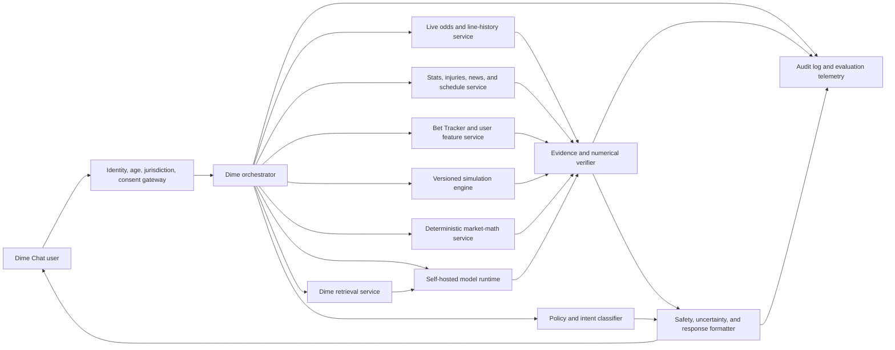

# Dime AI: Foundation Model, Training, and Platform Strategy

> Historical background dated 2026-07-24. This research informs the governed
> project but is not current runtime, release, or deployment authority. See
> `../PLATFORM_OWNERSHIP.md`, `../RELEASE_GATES.md`, and the project README.

**Deep-research decision report**
**Research date:** July 24, 2026
**Scope:** A Dime Chat assistant for sports-matchup analysis, odds and market-history interpretation, personalized Bet Tracker coaching, game simulation, and detailed analytical writing.

---

## Executive decision

### The recommendation

Do **not** build Dime by “training” GPT-5.6 Sol, Claude, Gemini, or Grok through repeated conversations inside their consumer chat products. That process can create a strong prompt, knowledge base, workflow, and evaluation set, but it does **not** change model weights, create an owned Dime model, or produce something that can be embedded natively in Dime Chat.

Build Dime as a **model-agnostic intelligence system** whose durable value lives in:

1. licensed and timestamped sports/market data;
2. Dime’s Bet Tracker and user-scoped performance features;
3. deterministic market math and sport-specific simulation services;
4. Dime’s retrieval corpus, analytical rules, voice, and safety policy;
5. a proprietary evaluation set; and
6. an open-weight model that Dime can tune, host, replace, and audit.

The best current model strategy is a four-model bake-off:

| Role | First candidate | Why it belongs |
|---|---|---|
| **Best low-cost owned baseline** | **gpt-oss-20b** | Apache 2.0, fine-tunable, tool-capable, 128K context, and designed to run in about 16 GB of memory. |
| **Best balanced current open foundation** | **Gemma 4 12B or 26B A4B** | Apache 2.0, multimodal, multiple deployment sizes, up to 256K context, and a strong Google deployment/tuning ecosystem. |
| **Best efficient agent/tool challenger** | **Qwen3.6-35B-A3B** | Apache 2.0, only about 3B active parameters per token, long context, tool use, multimodal lineage, and broad open fine-tuning support. |
| **Best quality-first open candidate** | **Mistral Small 4** | Apache 2.0, native vision, configurable reasoning, 256K context, 119B total/6B active parameters, and unified chat/reasoning/agentic behavior. |

No public benchmark can identify the winner for Dime. Dime should choose the **smallest model that passes a blinded, chronological, Dime-specific evaluation**, with Mistral Small 4 as the quality ceiling and gpt-oss-20b as the cost floor.

If Dime later has an enterprise model-development budget, **Mistral Forge** is the strongest actual custom-model platform found in this research. It supports pretraining, post-training, reinforcement learning, synthetic-data generation, hyperparameter work, and continuous evaluation while keeping the resulting model under customer control. It is a real training platform—not a consumer-chat iteration feature. [Mistral Forge](https://mistral.ai/news/forge/)

### The proprietary-model verdict

- **ChatGPT / GPT-5.6 Sol:** excellent technical research environment, but **not viable for Dime’s proposed real-money betting product under current OpenAI policy**. OpenAI’s universal Usage Policies expressly prohibit use of its services for real-money gambling. A custom GPT also cannot be embedded in Dime, and chat iteration does not train Sol. [OpenAI Usage Policies](https://openai.com/policies/usage-policies/), [GPTs in ChatGPT](https://help.openai.com/en/articles/8554407-creating-a-gpt)
- **Claude / Opus 5:** probably the strongest current no-code analytical prototype environment for Dime, combining Projects, project RAG, Skills, memory, code execution, research, MCP connectors, and embeddable Artifacts. It still does not create owned weights; Anthropic currently offers no direct Claude fine-tuning, and using Claude outputs to train a general-purpose/open-ended Dime chatbot requires written permission. [Claude Opus 5](https://www.anthropic.com/news/claude-opus-5), [Anthropic output-training policy](https://support.claude.com/en/articles/12326764-can-i-use-my-outputs-to-train-an-ai-model)
- **Grok / Grok 4.5:** the best chat-only behavioral prototyping fit when live X information, shareable Skills, Projects, Automations, files, code, and custom MCP matter. It has no public tuning route for current Grok weights, no native Dime deployment without programmatic integration, and xAI’s enterprise terms prohibit using outputs to train another AI model. [Grok 4.5](https://x.ai/news/grok-4-5), [xAI Enterprise Terms](https://x.ai/legal/terms-of-service-enterprise)
- **Gemini / Gemini 3.6 Flash:** a strong multimodal and enterprise tool platform with 1M-token context, Google Search grounding, code execution, functions, File Search, and mature Vertex infrastructure. Current Gemini API/AI Studio models do not support fine-tuning; Google’s open **Gemma 4** family—not closed Gemini—is the relevant owned-model foundation. [Gemini models](https://ai.google.dev/gemini-api/docs/models), [Gemini tuning status](https://ai.google.dev/gemini-api/docs/model-tuning), [Gemma 4](https://ai.google.dev/gemma/docs/core)

### If “no API” is absolute

There are only two workable meanings:

1. **No third-party inference API:** feasible. Dime can self-host an open-weight model and expose it only through Dime’s private internal model service.
2. **No software interface to a model at all:** not feasible for a native Dime Chat product. The web/mobile interface still needs a controlled way to send requests to the model. Even a self-hosted model needs an internal endpoint or equivalent process boundary.

Consumer ChatGPT, Claude, Gemini, and Grok subscriptions are not legitimate substitutes for production integration, account sharing, browser automation, tenant isolation, or service-level control.

---

## 1. The central correction: four different things are being called “training”

The choice becomes much clearer when the work is named precisely.

| Activity | Changes weights? | Creates owned model? | Appropriate for Dime? |
|---|---:|---:|---|
| Prompt/system-instruction iteration | No | No | Yes—start here |
| Projects, Gems, Skills, uploaded files, memory | No | No | Yes for prototyping; not canonical storage |
| Retrieval-augmented generation (RAG) | No | Dime owns retrieval layer, not base weights | Yes—critical for changing facts and private data |
| Tool integration | No | Dime owns tools and logic | Yes—critical for market math and simulations |
| LoRA / supervised fine-tuning | Yes, adapter or selected weights | Yes, subject to base license | Later, for behavior and tool use |
| Preference tuning / DPO / RL | Yes | Yes, subject to base license | Later, after reliable evaluators |
| Continued pretraining | Yes | Yes, subject to base license/data rights | Only if large domain corpus justifies it |
| Pretraining from random initialization | Yes—all weights | Yes | No; incompatible with “keep costs low” |

OpenAI describes gpt-oss-20b as requiring roughly 16 GB of memory and gpt-oss-120b as fitting on a single 80 GB GPU, which makes adaptation attainable. By contrast, modern frontier pretraining involves enormous data and compute: Mistral says Large 3 was trained from scratch using 3,000 H200 GPUs, Meta describes Llama 4 training at tens-of-trillions-of-token scale and a 32,000-GPU cluster, and xAI describes Grok 4.5 training across tens of thousands of GB300 GPUs. These are not consumer-chat iteration projects. [Introducing gpt-oss](https://openai.com/index/introducing-gpt-oss/), [Mistral 3](https://mistral.ai/news/mistral-3/), [Llama 4](https://ai.meta.com/blog/llama-4-multimodal-intelligence/), [Grok 4.5](https://x.ai/news/grok-4-5)

For Dime, “building from scratch” should mean **building the Dime intelligence stack and adapting an open foundation**, not recreating the foundation model.

---

## 2. What Dime is actually building

Dime is not one language-model problem. It is at least six systems.

### 2.1 Current-game analyst

Needs:

- current injuries, lineups, availability, venue, weather, schedule, rest, and news;
- sport-specific statistics and matchup features;
- explicit “as of” timestamps;
- separation of sourced fact, computed result, model inference, and opinion;
- citations or source identifiers for every volatile claim.

The base model’s pretraining cutoff is not enough. This function is primarily a **retrieval and tool-grounding problem**.

### 2.2 Market analyst

Needs:

- book- and market-specific opening/current/closing prices;
- canonical line snapshots and event identity;
- implied-probability conversion and vig removal;
- movement decomposition by time and book;
- source-specific ticket and handle splits;
- alerts for stale, contradictory, or low-coverage data.

“Public betting splits” are never a universal view of the whole market. Each response should identify the **provider, sportsbook/sample, ticket-versus-money definition, market, and timestamp**. The model must not merge incomparable split feeds or call a source sample “the market.”

### 2.3 Personal betting coach

Needs:

- consented, authenticated access to one user’s Bet Tracker history;
- precomputed performance features;
- uncertainty and sample-size handling;
- no hindsight leakage;
- tenant isolation;
- behavior-sensitive responsible-gaming controls.

The LLM should interpret features such as:

- return, yield, volatility, drawdown, and stake consistency;
- closing-line value (CLV) and price-shopping behavior;
- calibration by estimated probability band;
- results by sport, league, side/total/prop, price band, book, bet timing, and wager type;
- sample size, recency, and shrinkage toward a baseline;
- expected versus realized outcomes;
- signs of chasing, increasing stakes after losses, or unhealthy session patterns.

Raw win rate or ROI alone is not evidence of skill. Dime should privilege repeatable process measures—especially price quality and calibration—and clearly communicate uncertainty.

### 2.4 Simulation analyst

Needs:

- a versioned, sport-specific predictive model;
- reproducible inputs and random seed;
- Monte Carlo or other appropriate numerical engine;
- distributional outputs, not a single invented score;
- backtesting and calibration;
- logged model/data version.

The language model should **call** the simulation engine and explain its output. It should never claim “I simulated 10,000 games” when it only generated prose. A valid simulation result should include at least:

- simulation engine and version;
- input-data snapshot;
- assumptions;
- number of trials and seed;
- win/cover/over distributions and intervals;
- sensitivity or scenario analysis;
- known omissions and model uncertainty.

### 2.5 Conversation and writing layer

Needs:

- Dime’s voice and terminology;
- concise and deep response modes;
- constructive, non-shaming coaching;
- consistent report schemas;
- continuity across conversations;
- refusal to manufacture data or certainty.

This is where post-training and preference tuning can help, after the data and tools are correct.

### 2.6 Safety and compliance layer

Needs:

- legal-age and jurisdiction controls outside the LLM;
- no automated wagering or bankroll transfer;
- no guaranteed-win, “lock,” “risk-free,” or chase-loss language;
- responsible-gaming intervention and cool-off behavior;
- clear AI disclosure;
- traceable source, data age, assumptions, and uncertainty;
- review with gaming and privacy counsel before launch.

The American Gaming Association’s code treats wagering as entertainment for responsible adults, uses a 21+ advertising standard, rejects guaranteed-success and chase-loss messaging, and calls for responsible-gaming disclosures. The National Council on Problem Gambling’s internet standards cover informed decisions, assistance, self-exclusion, advertising, payments, and product features. These are useful design baselines, not substitutes for jurisdiction-specific law. [AGA Responsible Marketing Code](https://www.americangaming.org/marketing-code/), [NCPG Internet Responsible Gambling Standards](https://www.ncpgambling.org/responsible-gambling/internet-standards/)

---

## 3. Current-platform comparison for Dime

Legend:

- **Strong**: material advantage
- **Conditional**: workable only with limitations, contract, policy review, or an API
- **No**: does not meet the requirement
- **Blocked**: current policy conflicts with the proposed core use

| Platform/model | Analytical ceiling | Chat/workspace iteration | Owned/tunable weights | Native Dime deployment without external API | Live/RAG/tool stack | Betting-policy fit | Best Dime role |
|---|---|---|---|---|---|---|---|
| **GPT-5.6 Sol / ChatGPT** | Excellent | Excellent | No; Sol is not fine-tunable | No | Excellent | **Blocked** by current real-money-gambling ban | None for Dime core absent written approval; only re-scoped sports analytics |
| **Claude Opus 5 / Claude** | Excellent | Excellent | No direct Claude tuning | Limited Artifact beta; otherwise no | Excellent | Conditional; conservative high-risk-finance interpretation and human review | Founder prototype and evaluation lab, with written policy clarification |
| **Grok 4.5 / Grok** | Excellent | Excellent, especially Skills/Projects | No current Grok tuning | No | Excellent; unique X Search edge | Conditional; no categorical ban found | Chat-only behavioral prototype and live-social research |
| **Gemini 3.6 Flash / Gemini** | Very strong | Strong | Closed Gemini: no current API tuning; older models on Vertex only | No | Excellent multimodal/Google tool stack | Conditional; age, regulated-use, advice, and geography controls | Hosted enterprise alternative if API constraint changes |
| **Gemma 4** | Must be tested on Dime | Dime supplies UI | Yes, Apache 2.0 | Yes, self-hosted | Strong Google/open ecosystem | Conditional on Dime law and policy controls | **Balanced owned foundation** |
| **gpt-oss-20b/120b** | Must be tested on Dime | Dime supplies UI | Yes, Apache 2.0 plus usage policy | Yes, self-hosted | Native reasoning/tool patterns; text only | Governed by open-model usage policy and law, not ChatGPT hosting policy | **Lowest-cost baseline / larger quality tier** |
| **Qwen3.6-35B-A3B** | Must be tested on Dime | Dime supplies UI | Yes, Apache 2.0 | Yes, self-hosted | Strong open agent/tool/fine-tuning ecosystem | Dime bears legal/safety responsibility | **Efficient agentic challenger** |
| **Mistral Small 4** | Highest-priority quality candidate | Dime supplies UI | Yes, Apache 2.0 | Yes, self-hosted | Strong open serving/fine-tuning support; multimodal | Mistral’s hosted policy differs; self-hosted open models are excluded from that policy’s scope | **Quality-first owned foundation** |
| **Mistral Forge** | Depends on custom result | Enterprise training workspace | Yes/customer-controlled | Yes, chosen infrastructure | Full training and eval lifecycle | Requires contract, law, governance | **Best actual custom-model platform** |
| **Llama 4 Scout/Maverick** | Capable but older in this comparison | Dime supplies UI | Yes under Meta’s custom license | Yes | Mature ecosystem; strong long context/multimodality | License and Dime controls require review | Secondary benchmark, not first choice |

### Why there is no single “best model” score

General reasoning benchmarks do not measure:

- whether a model uses the correct odds snapshot;
- whether it distinguishes handle from tickets;
- whether implied probabilities and vig removal are correct;
- whether projections are calibrated;
- whether a simulation is reproducible;
- whether bettor coaching respects sample size;
- whether one user’s history can leak to another;
- whether advice escalates unhealthy gambling behavior.

A weaker generic model with perfect tool use and grounding can outperform a frontier model that confidently analyzes stale or invented data. Dime should therefore evaluate the **whole system**, not just the language model.

---

## 4. Detailed proprietary-provider findings

### 4.1 OpenAI / ChatGPT

#### Technical strengths

GPT-5.6 Sol is OpenAI’s current flagship reasoning model. Its API form advertises roughly 1.05M context, 128K maximum output, structured output, function calling, web/file search, code execution, MCP/tool search, and extensive agentic tooling. ChatGPT’s available context and product limits are different from the API specification. [GPT-5.6 Sol model](https://developers.openai.com/api/docs/models/gpt-5.6-sol), [GPT-5.6 launch](https://openai.com/index/gpt-5-6/)

ChatGPT Projects, Workspace Agents, Skills, Deep Research, Data Analysis, files, MCP/apps, and evaluation workflows make it a high-quality general product-design environment. It can help define Dime’s schemas, calculation specifications, UI, test cases, and policy-compliant sports-analysis workflows.

#### Decisive blockers

1. OpenAI’s current universal Usage Policies prohibit its services from being used for **real-money gambling**. That reaches beyond the API and makes the proposed Dime betting assistant a hard policy mismatch unless OpenAI grants written authorization or Dime materially changes scope. [OpenAI Usage Policies](https://openai.com/policies/usage-policies/)
2. GPT-5.6 Sol does not support fine-tuning. Repeated chats, Projects, memory, Skills, and custom GPT knowledge do not update its weights.
3. A custom GPT cannot be embedded into Dime. OpenAI directs external-product builders to its developer platform; custom GPT conversations also start without the user’s other GPT conversations or saved personal memory. [Creating a GPT](https://help.openai.com/en/articles/8554397-creating-a-gpt%E2%80%8D)
4. A ChatGPT subscription cannot legitimately power a third-party service through account sharing, automated extraction, or browser automation.

#### Dime verdict

**Do not select ChatGPT/GPT-5.6 as Dime’s core development or production home under current policy.** The open-weight gpt-oss models are a separate path because they run on infrastructure controlled by Dime and use separate open-model terms.

### 4.2 Anthropic / Claude

#### Current best model

Claude Opus 5, released July 24, 2026, is the most attractive Claude for Dime’s core analytical work: 1M context, 128K output, a May 2026 cutoff, strong numerical/table/financial reasoning claims, and lower price than Claude Fable 5. Fable remains Anthropic’s nominal highest-capability broadly released option for the longest-running, hardest agents, but it is slower, more expensive, and subject to a 30-day covered-model retention requirement. Sonnet 5 is the practical high-volume iteration model. [Claude Opus 5](https://www.anthropic.com/news/claude-opus-5), [Claude model overview](https://platform.claude.com/docs/en/about-claude/models/overview)

#### Best no-code prototype stack

A strong founder prototype would use:

- one `Dime AI Core` Project;
- canonical project instructions;
- project RAG with methodologies and evaluated examples;
- a Dime Analysis Skill;
- a read-only OAuth MCP connector to Dime data;
- code execution for exploratory analysis;
- Research for sourced background work;
- Opus 5 for difficult reasoning and Sonnet 5 for bulk iteration.

Projects, Skills, RAG, memory, code execution, and MCP are unusually complete for behavior prototyping. Claude can also publish and embed AI-powered Artifacts. An Artifact could support an invited Dime alpha without Dime paying inference, but every user must authenticate with Claude, consumes their own Claude limits, and gains less native Dime identity, billing, moderation, observability, and version control. It is not a robust production substitute. [Claude Projects](https://support.claude.com/en/articles/9517075-what-are-projects), [Claude Skills](https://support.claude.com/en/articles/12512180-use-skills-in-claude), [Claude Artifacts](https://support.claude.com/en/articles/9547008-publish-and-share-artifacts)

#### Training and policy limits

- Claude model IDs have fixed weights; chats and projects do not update them.
- Anthropic’s direct Claude API currently has no fine-tuning endpoint.
- Anthropic prohibits using Claude outputs to train a competing general-purpose/open-ended text model without written permission. Dime may use Claude for product specifications, code, rubrics, and specialized non-competing tools, but should not silently turn Claude answers into Dime SFT targets. [Anthropic output-training policy](https://support.claude.com/en/articles/12326764-can-i-use-my-outputs-to-train-an-ai-model)
- Anthropic’s Usage Policy does not expressly name sports gambling as categorically prohibited. It does require AI disclosure for consumer chatbots and imposes qualified human review for consumer-facing recommendations in high-risk finance. Personalized wager recommendations are close enough to monetary decision guidance that Dime should obtain written Anthropic clarification and legal advice before relying on a hosted Claude workflow. [Anthropic Usage Policy](https://www.anthropic.com/legal/aup)

#### Dime verdict

**Best proprietary no-code analytical prototype, conditional on written policy clarification. Not an owned training foundation.**

### 4.3 xAI / Grok

#### Current strengths

Grok 4.5 is xAI’s current flagship for agentic work, coding, and knowledge work. Grok 4.3 offers a lower-cost/faster alternative and a larger advertised context. The platform combines web search, native X Search, code execution, persistent Collections/RAG, file search, custom functions, remote MCP, citations, and a beta multi-agent research model. [xAI model catalog](https://docs.x.ai/developers/models), [xAI tools](https://docs.x.ai/developers/tools/overview)

Grok’s consumer **Skills** preserve reusable instructions and workflows across conversations. Projects, memory, files, Automations, connectors, and shareability make it a particularly good place to iterate Dime’s:

- analytical voice;
- response formats;
- matchup-review procedure;
- responsible-gaming behavior;
- market-analysis checklist;
- simulation writeup schema.

Native X Search is a unique signal advantage for beat reporters, injuries, lineup rumors, and fast-moving sentiment. It is also a noisy source. Dime should treat X as an unverified signal until reconciled with league/team records and licensed market data.

#### Limits

- xAI documents no public fine-tuning endpoint for current Grok models.
- A Grok Skill or Project cannot be exported as Dime-owned weights or embedded as a native, arbitrary-user Dime assistant without programmatic integration.
- xAI’s enterprise terms prohibit using outputs to train another ML/AI model.
- Grok-1 is open under Apache 2.0 but is a raw 314B MoE checkpoint from 2023 with only 8K context and no dialogue fine-tuning; it is not a sensible low-cost foundation now. [Grok-1 open release](https://x.ai/news/grok-os)
- xAI’s current Acceptable Use Policy does not expressly prohibit betting analysis, but requires applicable-law compliance, AI transparency, regulated-industry safeguards, and human supervision for high-stakes decisions. [xAI Acceptable Use Policy](https://x.ai/legal/acceptable-use-policy)

#### Dime verdict

**Best chat-only prototype for persistent workflow behavior and live social signals; not an owned model foundation.** If Dime insists on using a proprietary consumer chat during the design phase, Grok is the cleanest functional fit of the four, subject to xAI’s written confirmation about the exact betting scope and without using its answers as training targets.

### 4.4 Google / Gemini and Gemma

#### Gemini strengths

Gemini 3.6 Flash is Google’s current stable production workhorse, with text/image/video/audio/PDF input, roughly 1M context, 64K output, thinking, code execution, functions, structured output, File Search, Google Search grounding, URL context, and preview computer use. Gemini 3.5 Flash-Lite provides a lower-cost route for extraction, tagging, routing, and bet-history preprocessing. [Gemini model catalog](https://ai.google.dev/gemini-api/docs/models), [Latest Gemini models](https://ai.google.dev/gemini-api/docs/latest-model)

Gemini Deep Research can plan, search, read, calculate, and return cited reports. File Search provides managed RAG. Gemini Enterprise adds connectors, access-control mapping, encryption options, and structured/unstructured data stores.

Gems provide reusable instructions and files, but Google’s cross-chat memory is not available inside Gems. A Gem is therefore a useful behavior sandbox, not a continuously trained or fully personalized Dime agent.

#### Training and deployment

Google says there is currently no fine-tuning for Gemini models in the Gemini API or AI Studio. Vertex supports tuning for selected older Gemini 2.5 models, but that is a developer/cloud workflow, not chat iteration. [Gemini tuning](https://ai.google.dev/gemini-api/docs/model-tuning), [Vertex model tuning](https://docs.cloud.google.com/vertex-ai/generative-ai/docs/models/tune-models)

**Gemma 4 is the important distinction.** Google’s current open family is Apache 2.0, multimodal, available as E2B, E4B, 12B, 26B A4B MoE, and 31B variants, with up to 256K context and deployment targets ranging from devices to servers. The 26B model activates roughly 4B parameters per token but must still load the full weights. Google supplies pretrained and instruction-following variants plus quantized formats and a mature ecosystem for adaptation and hosting. [Gemma 4 overview](https://ai.google.dev/gemma/docs/core), [Gemma 4 model card](https://ai.google.dev/gemma/docs/core/model_card_4)

Google’s API terms and generative-AI policies do not contain the same categorical sports-gambling ban found in OpenAI’s policy, but they prohibit illegal/regulated misuse, warn against reliance for professional advice, impose an 18+ requirement for API clients, and restrict using services to develop competing models. Dime still needs written clarification, age/geolocation controls, and legal review. [Gemini API Terms](https://ai.google.dev/gemini-api/terms), [Google Generative AI Prohibited Use Policy](https://policies.google.com/terms/generative-ai/use-policy)

#### Dime verdict

**Gemini is the strongest closed enterprise ecosystem of these candidates; Gemma 4 is the more relevant owned foundation.** Start the open-model bake-off with Gemma 4 12B and 26B A4B, not with the assumption that a Gemini Gem becomes Dime’s model.

---

## 5. Open-weight foundation shortlist

### 5.1 gpt-oss-20b and gpt-oss-120b

OpenAI’s gpt-oss models are not ChatGPT models and are not hosted in the OpenAI API. They are downloadable, Apache 2.0 open-weight models designed for self-hosting and customization. The 20B model has about 21B total/3.6B active parameters, 128K context, text-only input, configurable reasoning, structured output, and tool-use patterns; it can run in about 16 GB of memory. The 120B model has about 117B total/5.1B active parameters and can fit on one 80 GB GPU. [OpenAI open models](https://openai.com/open-models/), [Introducing gpt-oss](https://openai.com/index/introducing-gpt-oss/)

**Dime advantages**

- lowest barrier to a credible local reasoning baseline;
- permissive commercial license, subject to the gpt-oss usage policy;
- full fine-tuning and adapter-tuning control;
- good tool/structured-output starting point;
- 120B can become an offline quality tier if 20B is insufficient.

**Dime disadvantages**

- text-only;
- 2025-era foundation may trail 2026 open models on some tasks;
- Dime owns safety, hosting, monitoring, and updates;
- OpenAI-hosted ChatGPT policy should not be confused with the separate open-weight license and usage policy.

**Recommendation:** use 20B to build the first fully owned end-to-end Dime pipeline. Promote 120B only if the Dime evaluation shows a material gain worth the operating cost.

### 5.2 Gemma 4

Gemma 4 is the strongest breadth-of-deployment candidate: Apache 2.0, several model sizes, multimodal input, long context, pretrained and instruction-following checkpoints, quantized variants, and Google’s broad tooling.

**Dime advantages**

- current 2026 model family;
- multiple sizes allow one architecture from inexpensive experiments to stronger service tiers;
- vision can help with uploaded odds screens, bet slips, charts, and screenshots, although structured data should remain preferred;
- strong fit for Google Cloud or on-premises deployment.

**Dime disadvantages**

- open-model capability still requires Dime-domain validation;
- long context increases memory and latency; it is not a replacement for good retrieval;
- model-size choice and serving configuration require engineering.

**Recommendation:** test 12B as the practical baseline and 26B A4B as the stronger balance point.

### 5.3 Qwen3.6-35B-A3B

Qwen3.6 is an Apache 2.0 open family with strong emphasis on agentic coding/tool execution, thinking preservation, long context, and open fine-tuning. The 35B-A3B model activates about 3B parameters per token. The official project documents use with Transformers, vLLM, SGLang, llama.cpp, MLX, Qwen-Agent/MCP, and SFT/DPO/GRPO frameworks. [Official Qwen3.6 repository](https://github.com/QwenLM/Qwen3.6)

**Dime advantages**

- efficient MoE profile;
- broad tool and deployment ecosystem;
- current generation;
- attractive for structured tool routing and multi-step workflows.

**Dime disadvantages**

- its headline positioning emphasizes coding/agents rather than sports-domain judgment;
- operational and English dialogue quality must be tested against Gemma/Mistral/gpt-oss;
- security, dependency provenance, and deployment stack require review like any open model.

**Recommendation:** include it because Dime is tool-heavy; do not select it based on coding benchmarks.

### 5.4 Mistral Small 4

Mistral Small 4 is a 119B-total, 6B-active MoE model with 256K context, native text/image input, configurable reasoning, chat, coding, and agentic behavior under Apache 2.0. Mistral supports common open serving stacks. [Mistral Small 4](https://mistral.ai/news/mistral-small-4/)

**Dime advantages**

- strongest “one open model does everything” candidate in this set;
- native multimodality;
- reasoning effort can be traded against latency;
- permissive license and self-hosted control;
- Mistral Forge provides a future enterprise training path.

**Dime disadvantages**

- substantially heavier to load and serve than 12B/20B options despite sparse activation;
- higher operating and fine-tuning complexity;
- may be unnecessary if a smaller model follows tools reliably.

Mistral’s hosted Usage Policy restricts professional financial guidance, but the policy explicitly says it does not apply to products deployed on customer infrastructure or to open-source models/products. Dime still remains responsible for law and safety. [Mistral Usage Policy](https://legal.mistral.ai/terms/usage-policy)

**Recommendation:** make Small 4 the quality ceiling in the bake-off, not the automatic default.

### 5.5 Why Llama, DeepSeek, and older open Grok are not first choices

- **Llama 4 Scout/Maverick:** valuable multimodal and long-context models with a mature ecosystem, but they are older than the 2026 shortlist and use Meta’s custom license rather than Apache 2.0.
- **DeepSeek V4:** current high-end models are primarily documented as a hosted API route; that does not meet Dime’s no-external-API/owned-weights goal.
- **Grok-1:** open but obsolete for this use, enormous, raw, and short-context.
- **Gemma/Gemma-derived small edge models:** excellent for routing or on-device features, but Dime’s primary analyst should first prove sufficient reasoning and tool discipline.

---

## 6. Recommended Dime architecture

### 6.1 What belongs in weights

Good post-training targets:

- Dime tone and explanation style;
- correct selection and sequencing of tools;
- stable structured-output schemas;
- distinction between fact, calculation, simulation, and opinion;
- market-analysis and coaching rubrics;
- calibrated uncertainty language;
- safe response patterns;
- asking for missing data rather than inventing it.

### 6.2 What does not belong in weights

Keep these outside the model:

- current odds, injuries, schedules, lineups, and splits;
- user betting history and conversation history;
- jurisdiction rules that change;
- sportsbook-specific market definitions;
- simulation outputs;
- account permissions and consent;
- user-specific coaching profile;
- anything Dime must delete immediately on request.

These belong in versioned databases, tools, and retrieval because they change, require access control, need provenance, or must be deleted.

### 6.3 The model’s proper job

The LLM is the **orchestrator, analyst, and communicator**. It should:

1. understand the question;
2. identify required data and tools;
3. request authoritative, user-scoped records;
4. reason over returned evidence;
5. call deterministic calculation/simulation services;
6. explain findings, uncertainty, and counterarguments;
7. follow Dime’s safety and communication policy.

It should not be the source of truth for live data, an unaudited calculator, the simulator itself, or the canonical user database.

---

## 7. The Dime training and iteration loop

### Stage 0 — Create the Dime contract

Before tuning any weights, define:

- sports, leagues, wager markets, and jurisdictions in launch scope;
- Dime’s allowed and disallowed advice;
- the exact response taxonomy;
- authoritative data sources;
- source/freshness requirements;
- tool schemas;
- user-consent and deletion rules;
- responsible-gaming triggers;
- numerical definitions such as implied probability, fair price, hold, CLV, ROI, drawdown, and calibration.

Output: one version-controlled `Dime Intelligence Specification`.

### Stage 1 — Build a tool-grounded baseline

Run a candidate open model without fine-tuning. Give it:

- a concise system policy;
- RAG over stable Dime methodology;
- read-only data tools;
- the market-math service;
- the simulation service;
- output schemas;
- a verifier.

This shows whether the actual problem is model capability, missing data, bad retrieval, poor tool design, or an unclear prompt.

### Stage 2 — Build the evaluation set before the training set

Create at least 300–500 representative, human-reviewed Dime cases distributed across:

- pregame and in-game questions;
- sides, totals, moneylines, props, futures, and passes/no-bet decisions;
- clean, incomplete, stale, and conflicting data;
- opening-to-current-to-close line histories;
- ticket/handle split interpretation;
- implied-probability/vig/CLV calculations;
- simulations and sensitivity analysis;
- strong, weak, and statistically ambiguous bettor histories;
- small-sample traps and hindsight traps;
- user requests for certainty or loss-chasing;
- cross-user leakage attempts;
- unsupported source claims;
- latency and tool-failure cases.

Every evaluation should contain an **as-of timestamp and frozen source snapshot**. Otherwise, future model answers will be scored against facts that changed after the original decision time.

### Stage 3 — Capture iteration as structured evidence

For every reviewed answer, store:

- input and data snapshot IDs;
- tool calls and tool outputs;
- model/version/prompt/retrieval version;
- original answer;
- human accept/reject/edit;
- corrected answer;
- error tags;
- safety outcome;
- latency and compute cost.

Recommended error taxonomy:

- wrong or stale fact;
- missing provenance;
- incorrect math;
- unsupported inference;
- poor tool selection;
- bad simulation interpretation;
- ignored sample size;
- hindsight leakage;
- user-data leakage;
- overconfidence;
- unsafe gambling behavior;
- poor communication.

This converts “iteration” into a dataset that can later support real training.

### Stage 4 — Tune only recurring behavioral failures

Once Dime has enough high-quality, rights-cleared examples:

1. use LoRA/parameter-efficient SFT for schema adherence, tone, tool choice, and analysis sequence;
2. preserve a held-out, chronological test set;
3. compare against the untuned baseline;
4. reject tuning that improves style while harming facts, calibration, or tool use;
5. add preference tuning only when human preference labels and automatic graders agree reliably.

Do not fine-tune volatile sports facts into the model. OpenAI’s own cookbook guidance favors retrieval over fine-tuning for factual knowledge; tuning is better suited to task behavior and style. [OpenAI cookbook: search versus fine-tuning](https://developers.openai.com/cookbook/examples/question_answering_using_embeddings#why-search-is-better-than-fine-tuning)

### Stage 5 — Consider continued pretraining only with evidence

Continued pretraining could help if Dime accumulates a very large, rights-cleared corpus of:

- high-quality sports analysis;
- market mechanics;
- play-by-play and structured sport descriptions;
- coaching language;
- historical decision snapshots.

It is not justified merely because the model lacks today’s odds or injuries. Those belong in retrieval/tools.

### Training-data rights

Do not use outputs from Claude, Grok, Gemini, or ChatGPT as teacher labels for an open-ended Dime model unless the relevant provider gives written permission. Current provider terms commonly restrict using services or outputs to develop competing general-purpose models.

Prefer:

- Dime-authored expert answers;
- licensed sports and odds data;
- human-created rubrics;
- independently computed labels;
- consented and appropriately de-identified first-party examples;
- synthetic data generated by a model whose license permits that use, followed by human verification.

---

## 8. Evaluation framework: what “best” means for Dime

### 8.1 Hard gates

A model/system fails regardless of writing quality if it:

- invents a current line, injury, split, or source;
- performs odds math incorrectly;
- claims a simulation that did not run;
- exposes another user’s data;
- gives prohibited certainty or chase-loss guidance;
- cannot identify stale or missing data;
- violates Dime’s output schema or policy on critical cases.

### 8.2 Core metrics

| Dimension | What to measure |
|---|---|
| **Data fidelity** | Correct source, book, market, event, timestamp, and sample definition |
| **Numerical correctness** | Implied probability, vig removal, fair price, expected value, CLV, aggregation |
| **Calibration** | Brier score, log loss, reliability curves, prediction intervals |
| **Market baseline** | Performance relative to closing consensus and simple bookmaker baselines |
| **Tool behavior** | Correct tool choice, arguments, sequencing, retries, and refusal when data is absent |
| **Simulation integrity** | Actual tool invocation, reproducibility, convergence, assumptions, sensitivity |
| **Personal coaching** | Sample-size awareness, no hindsight, actionable process feedback, respectful tone |
| **Grounding** | Unsupported-claim rate, citation/record match, correct “as of” wording |
| **Privacy** | Tenant isolation, minimum necessary context, deletion behavior, injection resistance |
| **Responsible gaming** | No guarantees, no chasing, proper vulnerability response, no autonomous wagers |
| **Product quality** | Helpfulness, clarity, latency, throughput, cost per successful case |

ROI should be reported, but not used as the primary model-quality metric. Betting ROI is noisy, selection-dependent, and vulnerable to backtest leakage. Calibration, CLV, chronological testing, and comparison to a market baseline are harder to game.

### 8.3 Bake-off protocol

1. Freeze the prompt, retrieval corpus, tools, and data snapshots.
2. Run Gemma 4 12B, Gemma 4 26B A4B, gpt-oss-20b, Qwen3.6-35B-A3B, and Mistral Small 4.
3. Use the same decoding and structured-output requirements where possible.
4. Blind graders to model identity.
5. Score hard gates first, then quality.
6. Measure latency and total infrastructure cost only for responses that pass.
7. Retest finalists with adversarial and live shadow traffic.
8. Select the smallest passing model; keep the interface model-agnostic.

A frontier proprietary model may be included as a **non-training benchmark** only when the vendor expressly permits Dime’s use case and Dime does not use restricted outputs as training targets.

---

## 9. Personalized bettor data and privacy

Dime’s combination of betting history, financial behavior, inferred strengths/weaknesses, and conversation history is sensitive behavioral profiling even where a particular statute does not label every field “sensitive.”

Minimum design:

- explicit opt-in for personalized analysis;
- clear explanation of what is analyzed and why;
- per-user and per-tenant access controls;
- encryption in transit and at rest;
- purpose limitation and minimum necessary retrieval;
- separate canonical bets from derived coaching features;
- export, correction, reset, and deletion controls;
- retention schedule;
- no raw user history in global model weights;
- aggregate/anonymized training only with a reviewed legal basis and consent where required;
- documented handling of subpoenas, incidents, and account takeover;
- no provider consumer account as the canonical datastore.

Recommended memory design:

1. **Event memory:** immutable bet records and market snapshots.
2. **Derived analytical memory:** versioned metrics computed from events.
3. **Conversation memory:** concise user-approved preferences and goals.
4. **Session context:** temporary facts needed for the current response.
5. **Global Dime knowledge:** non-user-specific methodology and approved examples.

The LLM receives only the minimum relevant slice for the current user and task.

---

## 10. Responsible-gaming product requirements

Dime’s coaching capability can help users make more reflective decisions, but it can also optimize engagement for someone showing signs of harm. The safety layer must be independent of the generative model.

### Required controls

- verify eligible age and jurisdiction before betting-oriented functions;
- disclose AI interaction and limitations;
- prohibit automated bet placement and money movement in the initial product;
- never call a wager a lock, guarantee, sure thing, or risk free;
- avoid instructing users to recover losses, increase stakes after losses, or solve financial problems through betting;
- show data age, source scope, sample size, assumptions, and uncertainty;
- separate educational analysis from a user’s final decision;
- detect concerning patterns and switch from optimization to a cool-off/support mode;
- support user-configured time, loss, deposit, and notification limits where Dime’s product scope permits;
- maintain human review/escalation for policy-edge cases;
- test the model specifically against persuasive/manipulative engagement;
- obtain gaming, privacy, advertising, and AI counsel in each launch jurisdiction.

No model vendor’s general policy approval substitutes for a sportsbook/data license, gaming registration or license, geolocation, age verification, consumer-protection duties, or advertising rules.

---

## 11. Practical 90-day build plan

### Days 1–15: product and compliance foundation

- lock the launch sports, markets, and jurisdictions;
- obtain written legal interpretation of Dime’s role;
- contact candidate vendors for written betting-scope clarification;
- define data licenses and authoritative sources;
- write the Dime Intelligence Specification;
- define the safety policy and disallowed behaviors;
- define event, market, odds, split, bet, and simulation schemas.

**Exit criterion:** one versioned contract for what Dime may say, what data it needs, and how every number is defined.

### Days 16–35: tool and data foundation

- normalize event and market identity;
- build line-history and split retrieval;
- build deterministic odds/market math;
- create authenticated Bet Tracker feature access;
- build one sport-specific simulation service;
- add provenance, timestamp, and audit logging;
- implement model-independent orchestration interfaces.

**Exit criterion:** tools return correct, versioned results without an LLM.

### Days 36–50: untuned open-model baseline

- deploy gpt-oss-20b locally or on a controlled GPU;
- add Dime prompt, RAG, tools, schemas, and verification;
- create the first 300+ evaluation cases;
- log and tag every failure;
- establish latency and cost baselines.

**Exit criterion:** a complete owned pipeline, even if answer quality still needs improvement.

### Days 51–70: model bake-off

- test Gemma 4 12B/26B A4B, Qwen3.6-35B-A3B, and Mistral Small 4;
- blind human evaluation;
- run numeric, privacy, and safety hard gates;
- choose the smallest passing candidate;
- keep a higher-capability fallback only if routing materially improves quality.

**Exit criterion:** evidence-backed foundation choice, not a vendor-brand choice.

### Days 71–90: adaptation and controlled alpha

- curate accepted/corrected examples;
- run LoRA/SFT only on recurring behavioral/tool failures;
- retest against held-out chronological cases;
- conduct privacy and responsible-gaming red-team testing;
- launch a small, age/jurisdiction-controlled alpha;
- shadow-score every response and preserve rollback.

**Exit criterion:** measurable improvement over the untuned baseline without regressions in facts, calibration, privacy, or safety.

---

## 12. Final ranking by decision question

| Decision question | Winner | Qualification |
|---|---|---|
| Best raw proprietary analytical model/workspace for a founder prototype | **Claude Opus 5 in a Claude Project** | Conditional on Anthropic written clarification; do not use outputs to train Dime’s generative model without permission |
| Best persistent chat-only workflow prototyping and live-social research | **Grok 4.5 + Skills/Projects** | Not exportable, not tunable, not native Dime production |
| Best proprietary enterprise platform if Dime later allows an API | **Gemini/Vertex** | Strong multimodal/data ecosystem; closed Gemini is not owned weights |
| Best OpenAI model on pure technical ability | **GPT-5.6 Sol** | **Disqualified for proposed Dime use under current real-money-gambling policy** |
| Best low-cost owned starting model | **gpt-oss-20b** | Text-only and likely not the final quality winner |
| Best balanced current open foundation | **Gemma 4 12B or 26B A4B** | Must win the Dime evaluation |
| Best efficient agent/tool challenger | **Qwen3.6-35B-A3B** | Must prove sports reasoning, English coaching, and operations |
| Best quality-first open candidate | **Mistral Small 4** | Heavier infrastructure |
| Best real custom-model training platform | **Mistral Forge** | Enterprise, not low-cost consumer chat |
| Best overall Dime strategy | **Model-agnostic open-weight Dime stack** | Dime’s data, tools, simulator, memory, safety, and evals are the moat |

---

## 13. Immediate decision checklist

Before spending on fine-tuning, Dime should be able to answer “yes” to all of these:

- [ ] We have written policy confirmation or self-hosted license rights for the intended betting scope.
- [ ] We know where Dime is legally available and who may use it.
- [ ] We have licensed, timestamped odds/line/split data.
- [ ] We can explain the sample behind every betting split.
- [ ] Market math is deterministic and unit-tested.
- [ ] Simulations are real, reproducible, versioned, and backtested.
- [ ] Bet Tracker access is authenticated, consented, and user-scoped.
- [ ] User history remains outside global model weights.
- [ ] We have a responsible-gaming policy independent of the LLM.
- [ ] We have at least 300–500 frozen, chronological evaluation cases.
- [ ] We can swap the base model without rebuilding Dime.
- [ ] We measure calibration, grounding, privacy, and safety—not only eloquence or ROI.

---

## Conclusion

The most capable current chat model is not automatically the best foundation for Dime. The decisive requirements are **rights, control, deployability, data freshness, numerical integrity, user isolation, simulation reproducibility, and responsible-gaming behavior**.

The correct low-cost path is:

1. build the Dime system around authoritative tools and data;
2. establish an owned gpt-oss-20b baseline;
3. run a blinded bake-off against Gemma 4, Qwen3.6, and Mistral Small 4;
4. select the smallest model that passes Dime’s hard gates;
5. use fine-tuning only for stable behavior and tool use;
6. keep live facts, user histories, and simulations outside the weights;
7. move to Mistral Forge or another enterprise training platform only if evidence shows that open-model adaptation is insufficient.

That approach keeps cost low **without confusing a rented conversation with a trained asset**, and it makes the long-term moat Dime’s own intelligence system rather than whichever vendor happens to lead a general benchmark this month.

---

## Selected official sources

### OpenAI

- [GPT-5.6 launch](https://openai.com/index/gpt-5-6/)
- [GPT-5.6 Sol model documentation](https://developers.openai.com/api/docs/models/gpt-5.6-sol)
- [OpenAI Usage Policies](https://openai.com/policies/usage-policies/)
- [GPT creation and limitations](https://help.openai.com/en/articles/8554397-creating-a-gpt%E2%80%8D)
- [OpenAI open models](https://openai.com/open-models/)
- [Introducing gpt-oss](https://openai.com/index/introducing-gpt-oss/)

### Anthropic

- [Claude Opus 5](https://www.anthropic.com/news/claude-opus-5)
- [Claude model overview](https://platform.claude.com/docs/en/about-claude/models/overview)
- [Claude Projects](https://support.claude.com/en/articles/9517075-what-are-projects)
- [Claude Skills](https://support.claude.com/en/articles/12512180-use-skills-in-claude)
- [Claude output-training policy](https://support.claude.com/en/articles/12326764-can-i-use-my-outputs-to-train-an-ai-model)
- [Anthropic Usage Policy](https://www.anthropic.com/legal/aup)

### Google

- [Gemini model catalog](https://ai.google.dev/gemini-api/docs/models)
- [Gemini tool suite](https://ai.google.dev/gemini-api/docs/tools)
- [Gemini tuning status](https://ai.google.dev/gemini-api/docs/model-tuning)
- [Gemma 4 overview](https://ai.google.dev/gemma/docs/core)
- [Gemma 4 model card](https://ai.google.dev/gemma/docs/core/model_card_4)
- [Gemini API Terms](https://ai.google.dev/gemini-api/terms)

### xAI

- [Grok 4.5](https://x.ai/news/grok-4-5)
- [xAI model catalog](https://docs.x.ai/developers/models)
- [xAI tools](https://docs.x.ai/developers/tools/overview)
- [Grok Skills](https://x.ai/news/grok-skills)
- [xAI Acceptable Use Policy](https://x.ai/legal/acceptable-use-policy)
- [xAI Enterprise Terms](https://x.ai/legal/terms-of-service-enterprise)

### Open foundations and training platforms

- [Mistral Small 4](https://mistral.ai/news/mistral-small-4/)
- [Mistral Forge](https://mistral.ai/news/forge/)
- [Mistral Usage Policy](https://legal.mistral.ai/terms/usage-policy)
- [Official Qwen3.6 repository](https://github.com/QwenLM/Qwen3.6)
- [Meta Llama 4](https://ai.meta.com/blog/llama-4-multimodal-intelligence/)

### Responsible gaming

- [American Gaming Association Responsible Marketing Code](https://www.americangaming.org/marketing-code/)
- [National Council on Problem Gambling Internet Standards](https://www.ncpgambling.org/responsible-gambling/internet-standards/)
