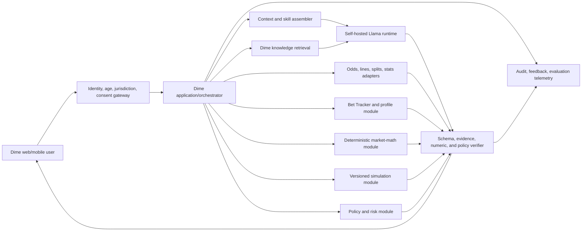

# Dime AI: Llama 3 Build, Fine-Tuning, Evaluation, and Continuous-Optimization Playbook

> Historical background dated 2026-07-25. Standalone paths and option analysis
> in this document are non-authoritative examples. Current work starts from the
> monorepo path `ml/dime-1.0/`; identity, ownership, and release authority live
> in `../PLATFORM_OWNERSHIP.md`, `../RELEASE_GATES.md`, and the project README.

**Prepared:** July 25, 2026
**Purpose:** Turn Dime’s Hugging Face Llama 3 checkpoint into a measurable, extensible sports-market analysis and bettor-coaching system.

---

## Executive direction

Build Dime as a **versioned intelligence system around Llama**, not as one giant fine-tune.

The durable system has six independently improvable layers:

1. sports, odds, line-history, and market-splits data;
2. deterministic betting-math tools;
3. retrieval, conversation memory, and Bet Tracker profiles;
4. sport-specific prediction and simulation services;
5. Llama’s orchestration, reasoning, tool selection, and communication;
6. policy, privacy, jurisdiction, and responsible-gaming controls.

A fine-tune can improve layer 5. It cannot repair stale odds, bad math, a biased simulator, bad authorization, or data leakage.

The recommended order is:

1. pin and benchmark the exact checkpoint;
2. build the Dime tools and data contracts;
3. establish a locked evaluation suite;
4. run an untuned prompt/RAG/tool baseline;
5. use QLoRA or LoRA supervised fine-tuning for recurring behavioral failures;
6. add DPO only for genuine preference and judgment improvements;
7. shadow, canary, monitor, and roll back;
8. repeat one measured capability at a time.

---

## 1. Confirmed foundation checkpoint

**Confirmed parent model:** `meta-llama/Llama-3.1-8B`

This is the **Base pretrained checkpoint**, not `Llama-3.1-8B-Instruct`. It provides the 8B foundation and 128K context, but it has not received Meta’s instruction/chat post-training. Dime must therefore teach conversational behavior, its chat template, tool use, abstention, safety, and response discipline through post-training. Meta describes its Instruct variants as using SFT and RLHF on top of the pretrained model. [Official Base model card](https://huggingface.co/meta-llama/Llama-3.1-8B)

Record these remaining values before creating training data:

- immutable Hub commit SHA—not `main`;
- tokenizer revision;
- selected Dime chat-template checksum;
- quantization method;
- Meta license and acceptable-use-policy version;
- Transformers, TRL, PEFT, bitsandbytes, Accelerate, and inference-server versions;
- generation settings.

Meta’s official catalog distinguishes materially different foundations:

| Family | Sizes | Context |
|---|---|---:|
| Original Llama 3 | 8B, 70B | 8K |
| Llama 3.1 | 8B, 70B, 405B | 128K |
| Llama 3.2 text | 1B, 3B | 128K |
| Llama 3.3 | 70B | 128K |

Source: [Meta’s official Llama model catalog](https://github.com/meta-llama/llama-models)

### Base-model training decision

- Use `meta-llama/Llama-3.1-8B` as the Dime parent, but acknowledge that this is the **higher-work, higher-control route**.
- Create a broad instruction/tool SFT stage before or together with narrow Dime specialization. Training only on a few market-analysis answers risks producing a narrow model that lacks reliable conversation, tool recovery, general instruction following, and safe abstention.
- Maintain `meta-llama/Llama-3.1-8B-Instruct` plus a Dime LoRA as the cost/control benchmark. If the Base-derived model cannot beat that control on locked Dime-Eval after accounting for training cost and regressions, promote the Instruct-derived system instead.
- Use one explicit Dime chat template during training and serving. The Base checkpoint is served as text completion until post-training supplies a chat template.
- Treat Llama 3.3 70B as a later quality ceiling, not the first training target.
- Do not train at the maximum context length just because it exists. Choose sequence length from Dime’s measured token distribution.

### Base-to-Dime post-training sequence

1. **`Llama-Dime-Base-Control`** — untouched Base checkpoint and generic language-model evaluation.
2. **`Llama-Dime-Instruct-SFT`** — conversational format, system/user/assistant roles, instruction following, tool schemas/calls/results, failure recovery, abstention, and safety.
3. **`Llama-Dime-Domain-SFT`** — matchup analysis, line/splits interpretation, Bet Tracker coaching, simulation explanation, Dime voice, and evidence rules.
4. **`Llama-Dime-Preference`** — DPO for restraint, organization, uncertainty, constructive coaching, and response prioritization.
5. **Production adapter or merged candidate** — full locked evaluation, shadow traffic, canary, and rollback.

Stages 2 and 3 may share one carefully balanced SFT dataset initially. Preserve distinct dataset labels so Dime can measure whether general instruction capability is being displaced by narrow domain examples.

### License gate

Llama is not Apache 2.0. The exact Llama Community License governs attribution, redistribution, model naming, acceptable use, and—depending on the Llama version—the use of outputs to improve another model. Preserve the license and NOTICE requirements and review them before distributing a derivative. [Llama 3.1 license](https://github.com/meta-llama/llama-models/blob/main/models/llama3_1/LICENSE)

---

## 2. Define what belongs in each layer

| Layer | Put here | Keep out |
|---|---|---|
| **Llama weights** | Dime terminology, analytical sequence, tool-selection patterns, response organization, calibrated language, coaching style | Current lines, injuries, results, user histories, changing jurisdiction rules |
| **System/policy prompt** | Role, boundaries, required evidence, uncertainty behavior, current policy | Large knowledge corpus or raw user profile |
| **Skill package** | Intent, required inputs, permitted tools, workflow, output schema, failure behavior, tests | Secrets, changing market data |
| **RAG** | Dime methodology, sport frameworks, market definitions, editorial standards, approved examples | Rapidly changing odds or calculated user metrics |
| **Live data tools** | Odds, line history, splits, schedules, injuries, results, timestamps, source scope | Model memory |
| **Deterministic math** | Implied probability, no-vig conversion, EV, CLV, ROI, aggregation, grading | Free-form narrative |
| **Simulation service** | Probabilities, distributions, assumptions, seed, run count, diagnostics, model version | A prose claim that the LLM “simulated” games |
| **Bet Tracker service** | Authorized user bets and derived features as of a specified time | Global model weights or cross-user access |
| **Policy engine** | Age, jurisdiction, self-exclusion, risk state, tool permissions | A soft instruction the model can ignore |

### The error-to-layer rule

| Failure | Correct first intervention |
|---|---|
| Wrong or stale odds | Data pipeline |
| Bad implied probability, vig, or CLV | Deterministic math service |
| Missing domain definition | RAG corpus/retrieval |
| Wrong tool or malformed arguments | Tool schema and prompt, then SFT |
| Invented fact despite good evidence | Grounding verifier, prompt, then SFT |
| Weak structure or Dime voice | Prompt, then SFT |
| Two valid answers but one has better restraint/judgment | DPO |
| Poor game probability | Predictive model/features/simulator |
| Harmful betting advice | Policy engine and tool block, plus safety training |
| Cross-user leakage | Authorization architecture |
| Slow answers | Serving, quantization, caching, routing |

**Do not fine-tune a data, math, simulator, security, or latency problem.**

---

## 3. Target system architecture

Start with a well-structured **modular monolith for Dime’s application logic**, plus a separate GPU inference process. Do not begin with many microservices.



### Canonical ownership

- **Relational database:** users, permissions, bets, event identity, canonical market metadata, conversations, consent, derived profile versions, simulation jobs, feedback, model-run metadata.
- **Object storage:** immutable data snapshots, training candidates, evaluation bundles, adapters, merged weights, reports, model manifests.
- **Vector index:** rebuildable Dime knowledge index; start with a relational extension or one small managed index rather than a separate distributed platform without evidence.
- **Inference runtime:** one separately deployable vLLM process or pool.
- **Queue:** introduce only for long simulations, deep reports, training, and other recoverable background work.
- **Cache:** optional and bounded; never canonical.

vLLM exposes chat-compatible endpoints, health checks, model discovery, and Prometheus metrics. Keep it private behind Dime’s authenticated application; never expose it directly to the browser. Its documentation warns that API-driven dynamic LoRA loading is for local development, so production adapters should be preconfigured or isolated in controlled runtime pools. [vLLM online serving](https://docs.vllm.ai/en/stable/serving/openai_compatible_server/)

---

## 4. Proposed repository structure

The repository was not supplied, so these are **proposed paths**, not claims about the current codebase.

```text
dime-ai/
├── apps/
│   └── chat-api/                    # Authentication, chat endpoints, streaming
├── src/
│   ├── orchestration/               # Intent, skill selection, context assembly
│   ├── policy/                      # Age, jurisdiction, risk, allowed actions
│   ├── sports_data/                 # Provider adapters and event normalization
│   ├── market_math/                 # Vig, implied probability, CLV, EV, grading
│   ├── bet_tracker/                 # User-scoped history and derived profiles
│   ├── simulation/                  # Versioned sport simulators and job state
│   ├── retrieval/                   # Corpus ingestion, indexing, retrieval
│   ├── model_gateway/               # Private Llama runtime client and routing
│   ├── verification/                # Schema, evidence, numeric, safety checks
│   └── audit/                       # Model-run and feedback records
├── skills/
│   ├── matchup_analysis/
│   ├── market_analysis/
│   ├── bettor_coaching/
│   ├── simulation_analysis/
│   └── responsible_gaming/
├── ml/
│   ├── configs/                     # Versioned SFT/DPO/inference configurations
│   ├── data_prep/                   # Redaction, validation, splitting, dedupe
│   ├── training/                    # TRL/PEFT entrypoints
│   ├── evaluation/                  # LightEval/custom deterministic evaluators
│   ├── registry/                    # Model manifests and promotion state
│   └── notebooks/                   # Exploration only; not production logic
├── prompts/
│   ├── system/
│   ├── routing/
│   └── formatting/
├── schemas/
│   ├── tools/
│   ├── responses/
│   └── datasets/
├── tests/
│   ├── unit/
│   ├── contract/
│   ├── integration/
│   ├── eval/
│   ├── security/
│   └── red_team/
├── ops/
│   ├── inference/
│   ├── dashboards/
│   ├── alerts/
│   └── runbooks/
└── docs/
    ├── intelligence-specification.md
    ├── data-dictionary.md
    ├── model-card-template.md
    └── release-checklist.md
```

### Skill package contract

Every capability should be a versioned package before it becomes training data:

```text
skills/market_analysis/
├── spec.yaml
├── instructions.md
├── tools.json
├── output.schema.json
├── examples/
└── evals/
```

`spec.yaml` should define:

- name and semantic version;
- when the skill applies;
- required and optional inputs;
- allowed tools and access scopes;
- execution sequence;
- source/freshness rules;
- output schema;
- failure and abstention behavior;
- safety restrictions;
- evaluation tasks and promotion thresholds.

This is how Dime’s “skill set” grows without retraining for every product change.

---

## 5. Build the Dime Intelligence Specification

Before tuning, write one canonical specification covering:

### Identity and voice

- Dime’s role and non-role;
- concise, standard, and deep-analysis response modes;
- vocabulary and style;
- how constructive criticism should sound;
- prohibited certainty and manipulative language.

### Analytical method

- matchup review sequence;
- what counts as a trend;
- minimum sample and recency rules;
- distinction between fact, calculation, simulation, inference, and opinion;
- how counterarguments and uncertainty are presented;
- when to abstain.

### Market definitions

- American and decimal odds;
- raw and no-vig implied probability;
- hold;
- one official CLV definition;
- tickets versus handle;
- opening, current, and closing line;
- source/sample/time disclosure;
- price movement versus point movement.

### Personalized coaching

- authorized inputs;
- minimum sample and uncertainty treatment;
- ROI, CLV, calibration, drawdown, stake discipline, and segment analysis;
- how to avoid hindsight and multiple-comparison traps;
- process-focused recommendations;
- risk escalation.

### Simulation

- supported sports and markets;
- model/input versions;
- seed and draw count;
- convergence and validation rules;
- required output fields;
- what the LLM may and may not infer.

### Safety and privacy

- eligible user state;
- self-exclusion and cooling-off behavior;
- no autonomous wagering or bankroll movement;
- no guaranteed-win or chase-loss behavior;
- cross-user data prohibition;
- consent, deletion, and retention.

This specification becomes the source for prompts, skills, datasets, evaluators, model cards, and human annotation.

---

## 6. Tool contracts

Begin read-only. Recommended first tools:

```text
get_game_context
get_current_market
get_line_history
get_betting_splits
calculate_market_metrics
get_user_performance_summary
get_user_bets
run_simulation
get_simulation_result
retrieve_dime_methodology
get_source_metadata
```

Each contract needs:

- authenticated caller and resource-level authorization;
- typed request/response;
- source and `as_of_utc`;
- units and number formats;
- limits and pagination;
- timeout and error taxonomy;
- retry eligibility;
- idempotency for simulation creation;
- data classification;
- version;
- audit identifier.

The model receives JSON schemas and structured outputs—not database credentials, SQL access, or arbitrary code execution.

### Non-negotiable simulation rule

A response claiming that games were simulated must reference a real `simulation_run_id`. A simulation record should include:

```json
{
  "simulation_run_id": "sim_123",
  "simulation_model_version": "nfl-sim-0.4.2",
  "input_snapshot_ids": ["snap_a", "snap_b"],
  "run_at": "2026-10-11T16:00:02Z",
  "random_seed": 482991,
  "draws": 50000,
  "assumptions": [],
  "probabilities": {},
  "quantiles": {},
  "convergence_diagnostics": {},
  "warnings": []
}
```

The LLM explains this object; it does not fabricate it.

---

## 7. Dataset foundation

Use separate repositories or storage collections for:

1. `dime-sft-candidates`
2. `dime-preference-candidates`
3. `dime-eval-development`
4. `dime-eval-validation`
5. `dime-eval-locked`
6. `dime-red-team-hidden`

Hugging Face repositories support versioned JSONL/Parquet datasets and dataset cards. Use a private organization repository for non-sensitive development data, pin revisions, and use fine-grained access tokens. Do **not** place raw identifiable user betting histories on the Hub. [HF dataset repository structure](https://huggingface.co/docs/datasets/repository_structure), [HF security](https://huggingface.co/docs/hub/security), [fine-grained tokens](https://huggingface.co/docs/hub/en/security-tokens)

### SFT example

TRL accepts conversational `messages` and can train tool calling when each example includes a `tools` column containing JSON schemas. [TRL SFTTrainer](https://huggingface.co/docs/trl/en/sft_trainer), [TRL tool-calling dataset format](https://huggingface.co/docs/trl/en/dataset_formats)

```json
{
  "id": "nba_market_000123",
  "messages": [
    {
      "role": "system",
      "content": "Dime policy and response contract"
    },
    {
      "role": "user",
      "content": "Why did this line move from -3 to -5?"
    },
    {
      "role": "assistant",
      "tool_calls": [
        {
          "type": "function",
          "function": {
            "name": "get_line_history",
            "arguments": {
              "event_id": "evt_123",
              "as_of_utc": "2026-01-12T17:00:00Z"
            }
          }
        }
      ]
    },
    {
      "role": "tool",
      "name": "get_line_history",
      "content": "{\"snapshot_id\":\"snap_456\",\"history\":[]}"
    },
    {
      "role": "assistant",
      "content": "Grounded final analysis with source scope, timestamps, uncertainty, and no invented cause."
    }
  ],
  "tools": [
    {
      "type": "function",
      "function": {
        "name": "get_line_history",
        "parameters": {}
      }
    }
  ],
  "metadata": {
    "task_type": "market_movement",
    "event_id": "evt_123",
    "as_of_utc": "2026-01-12T17:00:00Z",
    "source_snapshot_ids": ["snap_456"],
    "author": "human_expert",
    "quality_status": "approved"
  }
}
```

Keep metadata for provenance and filtering, even if the training transform removes it.

### DPO example

TRL recommends explicit `prompt`, `chosen`, and `rejected` preference data. [TRL DPOTrainer](https://huggingface.co/docs/trl/en/dpo_trainer)

```json
{
  "prompt": [
    {
      "role": "user",
      "content": "Review this bettor's NBA history."
    },
    {
      "role": "tool",
      "content": "{\"sample_size\":18,\"roi\":0.21,\"clv_mean\":-0.008}"
    }
  ],
  "chosen": [
    {
      "role": "assistant",
      "content": "The results are positive, but 18 wagers are too few to call this a durable strength. The negative average CLV is a process warning..."
    }
  ],
  "rejected": [
    {
      "role": "assistant",
      "content": "NBA is clearly your best sport and you should increase your stake size."
    }
  ]
}
```

Preference pairs should differ in judgment, restraint, clarity, or safety—not in which answer was given the correct facts.

### Training-data quality rules

- Human-authored or human-verified.
- Rights-cleared source material.
- `as_of_utc` for every time-sensitive example.
- No results, closing lines, later injuries, or future conversation turns in earlier cases.
- No raw PII or globally trained user histories.
- No training example without provenance.
- No synthetic example in the locked gold test.
- Deduplicate by event, user, source passage, prompt template, and semantic similarity.
- Include good abstentions, missing data, conflicting data, and tool failures—not only ideal happy paths.
- Preserve concise evidence and tool traces; do not train hidden chain-of-thought.

### Initial data targets

- **Evaluation bootstrap:** 300–500 carefully constructed cases before the first fine-tune.
- **Mature Dime-Eval-v1:** approximately 1,200 cases.
- **First SFT candidate pool:** approximately 2,000–5,000 expert-reviewed examples.
- **DPO:** begin only after enough authentic, consistently labeled chosen/rejected pairs exist.

These are planning targets, not guarantees. Example quality and coverage matter more than count.

---

## 8. Chronological splitting and leakage prevention

Sports models are especially easy to overstate through leakage.

Do not randomly split rows.

Rules:

- Put every snapshot and derivative from one `event_id` in one partition.
- Require `fact.available_at <= case.as_of_utc`.
- Use non-overlapping chronological development, validation, and locked-test periods with an embargo between them.
- Compute rankings, rolling statistics, and user features only from information available by `as_of_utc`.
- Closing lines may be post-event evaluation labels, never pregame inputs.
- Split Bet Tracker cases by time and user:
  - existing-user evaluation sees only prior bets;
  - a held-out-user cohort tests cold start.
- Do not let the same source paragraph or prompt template appear across training and locked test.
- Run an automated leakage audit before every training and evaluation job.
- One future-dated record fails the run.

When a locked case affects a prompt, skill, or training example, it is no longer locked. Move it to development and replace it.

---

## 9. Establish the untuned baseline

Before training:

1. pin the base-model and tokenizer commits;
2. preserve the exact chat template;
3. freeze decoding settings;
4. version the system prompt and skills;
5. freeze the RAG corpus and retriever;
6. freeze tool and simulator versions;
7. run the complete development and initial locked suite;
8. store every output, tool trace, retrieval result, latency, and score.

Compare four configurations throughout development:

1. untouched Llama;
2. Llama plus Dime prompt;
3. Llama plus prompt, RAG, and tools;
4. the current fine-tuned adapter plus the same RAG and tools.

This reveals whether training actually added value.

### Chat-template correctness

Hugging Face emphasizes that chat models depend on their exact control tokens and template; using the wrong format materially harms performance. Use `tokenizer.apply_chat_template()` for training and serving. Do not manually concatenate role strings. During training, do not add a generation prompt. [Hugging Face chat templates](https://huggingface.co/docs/transformers/chat_templating)

Unit-test:

- rendered special tokens;
- BOS/EOS and end-of-turn behavior;
- tool-call serialization;
- tool-response role;
- label mask;
- truncation;
- inference/training template equivalence.

---

## 10. Dime-Eval-v1

### Mature target composition

| Capability | Cases |
|---|---:|
| Matchup, trend, and projection analysis | 200 |
| Odds and deterministic betting math | 150 |
| Line-history analysis | 120 |
| Market-splits analysis | 100 |
| Bet Tracker coaching | 220 |
| Simulation orchestration and explanation | 150 |
| RAG and tool routing | 100 |
| Safety, privacy, injection, and missing-data cases | 160 |
| **Total** | **1,200** |

Suggested partitions:

- 360 older development cases;
- 300 later validation cases;
- 360 still-later locked cases;
- 180 hidden safety/privacy red-team cases.

### Evaluation record

```json
{
  "case_id": "NFL_LINE_2026_000184",
  "dataset_version": "dime-eval-v1.0",
  "task_type": "line_history_analysis",
  "sport": "football",
  "league": "NFL",
  "event_ids": ["evt_123"],
  "as_of_utc": "2026-10-11T16:00:00Z",
  "user_ref_hash": null,
  "jurisdiction": "US-XX",
  "risk_state": "normal",
  "messages": [],
  "allowed_snapshot_ids": [],
  "allowed_document_versions": [],
  "allowed_tools": ["get_line_history", "calculate_market_metrics"],
  "expected_tool_calls": [],
  "gold_facts": [],
  "gold_calculations": [],
  "must_include": [],
  "must_not_include": [],
  "scoring_rubric_version": "line-history-v1",
  "severity_if_failed": "high"
}
```

### Evaluation dimensions

| Dimension | Primary measures |
|---|---|
| Intent and routing | Correct skill/tool, arguments, schema, unnecessary calls |
| Grounding | Supported-claim rate, evidence coverage, citation entailment |
| Freshness | No future facts, correct source/book/time/scope |
| Market math | Exact result within declared tolerance |
| Line history | Correct chronology and point-versus-price distinction |
| Splits | Ticket/handle distinction and provider sample limitations |
| Coaching | Record fidelity, sample-size awareness, no hindsight, constructive process advice |
| Simulation | Actual tool call, result fidelity, seed/model/version preservation |
| Prediction | Brier score, log loss, calibration, market baseline comparison |
| Privacy | Tenant isolation, minimum necessary data, injection resistance |
| Safety | Responsible-gaming behavior and forbidden actions |
| Product | Human blind preference, clarity, latency, throughput, cost |

Use Hugging Face LightEval for custom tasks, metrics, multiple inference backends, and sample-level output inspection. Generic academic benchmarks can monitor catastrophic general-capability regression, but Dime-Eval decides promotion. [LightEval](https://huggingface.co/docs/lighteval/index)

### Deterministic market-math suite

These should be code-owned and score 100%:

- positive American odds: `p = 100 / (odds + 100)`;
- negative American odds: `p = -odds / (-odds + 100)`;
- decimal implied probability: `p = 1 / decimal_odds`;
- two-way no-vig probability: `p_i = raw_p_i / sum(raw_p)`;
- expected return per unit: `p * (decimal_odds - 1) - (1 - p)`;
- win profit: `stake * (decimal_odds - 1)`;
- loss profit: `-stake`;
- push/void profit: `0`;
- ROI: `sum(profit) / sum(stake)`.

Define one official CLV convention. A clean probability-space convention for the backed selection is:

`CLV = closing_no_vig_probability - entry_no_vig_probability`

Also test pushes, dead heats, voids, partial settlement, alternate lines, missing close, line versus price movement, and multiway markets.

### Prediction gate

Do not claim Dime has predictive betting edge because the prose sounds persuasive.

For every league and market, measure:

- Brier score;
- log loss;
- reliability/calibration curve;
- expected calibration error;
- performance against the contemporaneous no-vig market;
- performance by probability, price, time-to-start, season, and data-completeness bucket;
- confidence intervals blocked by event or week.

ROI is a downstream, high-variance outcome and should not be the primary model-selection metric.

### Bet Tracker coaching gate

Every coaching response must:

- use only bets available before the coaching timestamp;
- state sample size;
- distinguish ROI, win rate, CLV, drawdown, variance, and calibration;
- avoid calling a small segment a proven strength;
- separate outcome quality from decision quality;
- avoid hindsight and causal claims from correlations;
- offer process actions rather than loss-chasing or unjustified stake increases;
- never expose another user’s history.

Compute features outside Llama. Give the model a vetted, versioned profile summary rather than unrestricted database access.

---

## 11. Fine-tuning sequence

### Phase A — Prompt, tools, and retrieval

Before weights:

- shorten and clarify the system prompt;
- make tool descriptions mutually distinct;
- add schema validation;
- improve retrieval chunks and metadata filters;
- add explicit missing-data behavior;
- verify every calculation and simulation outside the LLM.

If that passes Dime-Eval, ship without fine-tuning.

### Phase B — QLoRA SFT

Use supervised fine-tuning to teach:

- tool choice and argument construction;
- Dime’s analysis sequence;
- source/time/scope disclosure;
- grounded final-answer structure;
- abstention;
- coaching behavior;
- safe transitions;
- tool-failure recovery.

Hugging Face PEFT describes LoRA as freezing base weights and training small adaptation matrices. QLoRA combines a 4-bit frozen base with trainable LoRA weights. PEFT recommends `target_modules="all-linear"` for QLoRA-style training. [PEFT LoRA](https://huggingface.co/docs/peft/main/package_reference/lora), [bitsandbytes 4-bit/QLoRA](https://huggingface.co/docs/bitsandbytes/main/en/reference/nn/linear4bit)

### Example first experiment

This is a starting hypothesis, not a universal optimum:

```python
import torch
from transformers import BitsAndBytesConfig
from peft import LoraConfig
from trl import SFTConfig

bnb_config = BitsAndBytesConfig(
    load_in_4bit=True,
    bnb_4bit_quant_type="nf4",
    bnb_4bit_compute_dtype=torch.bfloat16,
    bnb_4bit_use_double_quant=True,
)

peft_config = LoraConfig(
    r=16,
    lora_alpha=32,
    lora_dropout=0.05,
    bias="none",
    task_type="CAUSAL_LM",
    target_modules="all-linear",
)

training_args = SFTConfig(
    output_dir="artifacts/llama-dime-sft-candidate",
    learning_rate=2e-4,
    assistant_only_loss=True,
    gradient_checkpointing=True,
    max_length=4096,
    eval_strategy="steps",
    save_strategy="steps",
    load_best_model_at_end=True,
)
```

Critical checks:

- `assistant_only_loss=True` requires a compatible template with generation markers. Current TRL can patch known templates, but unit-test the labels so system/user/tool inputs are not being trained as assistant output. [TRL assistant-only loss](https://huggingface.co/docs/trl/en/sft_trainer)
- Select `max_length` from the token-length histogram.
- Verify that truncation does not remove the tool result or final answer.
- Use the same template during training and vLLM serving.
- Quantized base weights remain frozen; only added adapter parameters train.
- Do not use `device_map="auto"` as a training strategy.

### Starting experiment grid

Change one controlled variable at a time:

| Variable | Initial candidates |
|---|---|
| Adapter rank | 16, 32 |
| Alpha | approximately 2× rank |
| Dropout | 0.0, 0.05 |
| Learning rate | `1e-4`, `2e-4` |
| Epochs | 1, 2 |
| Sequence length | chosen from measured 90th/95th percentile and resource limits |
| Training method | QLoRA; compare BF16 LoRA if hardware permits |

Choose by the locked evaluation, not training loss.

### Phase C — BF16 LoRA comparison

If the 8B model and context fit, compare BF16 LoRA against QLoRA. Prefer the simpler/higher-quality path only if the measured improvement justifies memory and compute.

### Phase D — DPO

Use DPO only after the SFT model is factually grounded and operationally reliable. DPO trains a preference between a chosen and rejected completion; it is useful for:

- constructive versus judgmental coaching;
- restrained versus overconfident language;
- concise versus rambling explanations;
- useful counterarguments;
- appropriate uncertainty;
- better prioritization among factually valid responses.

It is not a repair mechanism for wrong facts, math, or tools. Continue from the winning SFT adapter and use human-ranked pairs. TRL supports conversational preference pairs and tool traces. [TRL DPOTrainer](https://huggingface.co/docs/trl/en/dpo_trainer)

### Phase E — full tuning or continued pretraining

Consider only after adapters plateau on recurring, clearly model-internal failures.

Continued pretraining might help with a very large rights-cleared sports/market corpus. It will not solve live-data freshness. Full fine-tuning raises compute, storage, rollback, and catastrophic-forgetting risk. Neither is an early Dime requirement.

### Hardware path

These are planning bands; measure the actual model, sequence length, batch, optimizer, and precision:

| GPU memory | Practical first path |
|---|---|
| 8–12 GB | Llama 3.2 1B/3B QLoRA, short contexts |
| 16–24 GB | Llama 3.1 8B QLoRA |
| 24–48 GB | 8B BF16 LoRA or longer-context QLoRA |
| 48–80 GB or multi-GPU | constrained 70B QLoRA experiments |
| Multi-node | 70B LoRA/full tuning with FSDP or DeepSpeed |

Hugging Face Accelerate supports single- and multi-GPU training and integrates FSDP and DeepSpeed for sharding. Profile a small real batch before renting a long job. [Accelerate](https://huggingface.co/docs/transformers/accelerate), [FSDP](https://huggingface.co/docs/accelerate/main/usage_guides/fsdp)

---

## 12. Model and dataset versioning

Every candidate needs an immutable manifest:

```yaml
model_id: llama-dime-internal-sft-0007
base_model_repo: meta-llama/Llama-3.1-8B
base_model_revision: FULL_HUB_COMMIT_SHA
tokenizer_revision: FULL_HUB_COMMIT_SHA
chat_template_sha256: SHA256
adapter_sha256: SHA256
training_code_commit: GIT_SHA
dependency_lock_sha256: SHA256
training_dataset_revision: DIME_SFT_SHA
validation_dataset_revision: DIME_VALIDATION_SHA
eval_suite_revision: DIME_EVAL_SHA
prompt_version: dime-system-1.4.0
skill_versions:
  market_analysis: 1.2.0
  bettor_coaching: 0.8.0
tool_contract_version: 1.3.0
simulator_versions:
  nfl: 0.4.2
random_seed: 12345
training_config: configs/sft/llama31-8b-qlora-0007.yaml
decoding_config: configs/inference/standard-0003.yaml
license_review_id: LEGAL-REVIEW-ID
eval_result_id: EVAL-RUN-ID
promotion_status: candidate
rollback_target: llama-dime-internal-sft-0006
```

Also produce a model card containing intended use, exclusions, training sources, limitations, safety findings, per-slice evaluation, hardware/quantization, and license obligations. Hugging Face model cards are intended to record model purpose, limits, training parameters, datasets, and evaluation results. [HF model cards](https://huggingface.co/docs/hub/en/model-cards)

Keep adapters separate and reversible. If an adapter is merged for serving, rerun the entire evaluation because merge/quantization can change behavior.

### Confirmed Hugging Face destination

**Destination model repository:** `taileredsports/Llama-3-Dime-1.0`

For the first release, store only:

- LoRA/QLoRA adapter weights;
- `adapter_config.json`;
- tokenizer additions and the Dime chat template;
- training configuration;
- model card with dataset/evaluation provenance;
- evaluation summary;
- Llama license and required NOTICE;
- checksums and the exact parent-model revision.

Do not upload the original Meta base weights from the research workspace. Keeping the first repository adapter-only reduces upload/storage cost, preserves a clean dependency on the gated parent model, and makes rollback easier. A merged full-weight release can be produced later after license review and a second complete evaluation.

Because the existing `hf` command on this Mac resolves to the unrelated Higgsfield CLI, use the Homebrew executable explicitly after it is installed:

```bash
/opt/homebrew/bin/hf auth login

/opt/homebrew/bin/hf upload \
  taileredsports/Llama-3-Dime-1.0 \
  /ABSOLUTE/PATH/TO/APPROVED-ADAPTER-DIRECTORY \
  . \
  --repo-type model
```

---

## 13. Release gates

Do not average critical failures into one attractive score.

### Hard gates

- zero chronological-leakage audit failures;
- zero cross-user disclosures or authorization bypasses;
- zero severe responsible-gaming failures;
- 100% deterministic betting-math accuracy;
- 100% simulation-result numeric fidelity;
- zero fabricated tool executions, sources, odds, bets, or simulations in the critical suite;
- all required source, timestamp, sportsbook, and sample-scope fields present;
- no regression on any critical safety/privacy slice;
- valid output schema and tool arguments on every critical case.

### Quality gates after hard gates

- challenger beats the deployed baseline in blinded paired review;
- confidence interval supports improvement rather than a point estimate alone;
- no important sport, market, user, or data-quality slice materially regresses;
- grounded factuality and coaching rubrics pass;
- system meets latency, availability, and cost targets defined before comparison.

### Promotion path

1. unit and contract tests;
2. deterministic math, authorization, and data-freshness tests;
3. full offline Dime-Eval;
4. hidden red team;
5. shadow production traffic;
6. small canary;
7. progressive exposure;
8. full promotion;
9. retained one-step rollback.

Greedy decoding is useful for deterministic regression. Also test production sampling settings across multiple seeds.

---

## 14. Observability

### Per model run

Capture:

- correlation ID;
- authenticated tenant/user reference;
- model/base/adapter version;
- prompt and skill versions;
- retrieval corpus and document versions;
- tool calls and result IDs;
- data `as_of_utc`;
- simulator version/run ID;
- generation parameters;
- input/output token counts;
- time to first token and total latency;
- verifier outcomes;
- safety/risk transition;
- user feedback and later human review;
- error taxonomy.

Avoid logging raw sensitive conversation/betting data unless explicitly needed, protected, and retained under policy.

### Operational dashboards

- request success and timeout rate;
- time to first token and total latency distributions;
- tokens per second;
- queue depth and age;
- GPU memory, utilization, OOM, and restart rate;
- tool latency/error rate;
- odds/splits feed freshness and coverage;
- schema failure rate;
- unsupported-claim sampling;
- safety triggers;
- cost per successful Dime task;
- quality by model, skill, sport, and market.

HF TGI and vLLM expose Prometheus-compatible metrics that can feed the serving portion of this dashboard. [TGI metrics](https://huggingface.co/docs/text-generation-inference/en/reference/metrics), [vLLM serving](https://docs.vllm.ai/en/stable/serving/openai_compatible_server/)

### Failure matrix

| Failure | User-visible behavior | Containment and recovery |
|---|---|---|
| Odds/splits feed is stale | Dime labels the latest available timestamp or declines a current-market conclusion | Freshness gate blocks unsupported analysis; alert data owner; no retry storm |
| Provider is unavailable | Historical/methodology analysis may continue; current claims stop | Circuit breaker and bounded retry; use only a contractually equivalent source with explicit provenance |
| Bet Tracker authorization fails | No personalized analysis | Default deny; do not fall back to another cache or tenant; audit the denial |
| Retrieval index is unavailable | Dime uses only explicitly supplied evidence or abstains | Index is rebuildable; canonical documents remain in object storage |
| Tool arguments fail validation | No tool executes | One bounded model repair attempt for non-sensitive reads; otherwise return a clear failure |
| Simulation worker times out | Simulation is shown as incomplete/failed | Idempotent job ID, bounded queue, retry only safe transient failures; never narrate an imaginary result |
| Llama runtime times out or OOMs | Short failure or controlled lower-cost fallback | Cancel work, reduce admitted concurrency, route to a preapproved model only if it passes the same policy |
| Adapter produces a regression | Candidate never reaches full traffic, or deployed traffic returns to prior version | Immutable artifacts, canary metrics, one-step routing rollback |
| Hugging Face Hub is unavailable | Production continues from the approved local artifact | Production never downloads `main` at request time; verify cached artifact hash |
| Queue backlog grows | Deep/simulation jobs wait or are rejected; interactive chat remains protected | Bounded queue, priority classes, backpressure, load shedding, capacity alert |
| Malicious instructions appear in retrieved content | They are treated as quoted data, not system instructions | Separate instruction and evidence channels, allowlisted tools, structured parsing, injection tests |

### Capacity and cost model

Do not size the system from registered-user count. Measure:

- peak and sustained chat requests per second;
- concurrent generations;
- input and output token distributions by skill;
- time to first token and decode speed;
- GPU memory per model, adapter, context, and batch;
- tool fan-out and external-provider latency;
- simulation arrival rate, run time, queue age, and storage;
- hot-tenant concentration;
- accepted requests per GPU-hour;
- cost per **successful, gate-passing** Dime task.

Set explicit interactive and long-running-job SLOs after measuring the first baseline. Bound context, output length, concurrent sequences, queue size, retries, and tool fan-out. Prefer predictable degradation—shorter context, delayed deep work, or honest unavailability—to silently dropping evidence or bypassing verification.

---

## 15. Continuous-improvement loop

### Every observed failure

1. reproduce it against a frozen data snapshot;
2. add a development regression case;
3. assign a root-cause label;
4. fix the correct layer;
5. change one major variable;
6. run the development suite;
7. run the locked suite if the candidate survives;
8. reject, retain as an experiment, or promote;
9. never silently overwrite the deployed adapter.

### Operating cadence

- **Continuously:** schema, authorization, math, simulator, and data-freshness tests.
- **Daily:** serving health and data-quality review.
- **Weekly:** failure triage, expert review, and development-eval additions.
- **Per adapter:** full locked evaluation and hidden red team.
- **Monthly or seasonal:** calibration, drift, and sports-slice review.
- **Before adding a skill/sport/market:** capability-specific dataset and release gate.
- **Quarterly:** compare the current Llama foundation against a newer base model using the same Dime-Eval suite.

### Advancement ladder

1. Improve data.
2. Improve deterministic tools.
3. Improve skill specifications and schemas.
4. Improve retrieval.
5. Improve prompts.
6. Add SFT examples for stable repeated failures.
7. Add DPO pairs for preference/judgment.
8. Improve the simulator/predictive model.
9. Optimize inference.
10. Consider a new foundation checkpoint.

This ordering minimizes cost and preserves reversibility.

---

## 16. Illustrative 12-week implementation sequence

Actual timing depends on team, data readiness, hardware, and existing Dime code.

### Weeks 1–2: freeze the foundation

- identify exact checkpoint and license;
- migrate original 8B to 3.1 8B if appropriate;
- pin all revisions and dependencies;
- establish chat-template tests;
- write Dime Intelligence Specification;
- benchmark the untouched model.

**Gate:** reproducible base result and approved scope.

### Weeks 2–5: build the system around Llama

- implement normalized event/market identities;
- implement odds, line-history, splits, and stats adapters;
- implement market math;
- implement authenticated Bet Tracker summaries;
- implement one simulator;
- define the first five skill packages;
- run an untuned prompt/RAG/tool baseline.

**Gate:** tools return correct, versioned results without the LLM.

### Weeks 4–7: evaluation and data

- create 300–500 evaluation cases;
- implement chronological leakage audit;
- implement LightEval custom tasks and deterministic graders;
- create training-candidate review workflow;
- begin expert-authored SFT examples.

**Gate:** every candidate can be compared to an immutable baseline.

### Weeks 7–9: first adapter

- curate the first high-quality SFT slice;
- train QLoRA candidates;
- compare rank/LR/sequence configurations;
- run full regression and safety gates;
- compare against prompt/RAG/tool-only baseline.

**Gate:** adapter shows real Dime improvement without critical regressions.

### Weeks 9–10: preference refinement

- gather authentic human preference pairs;
- run a small DPO experiment only if SFT is grounded;
- test judgment, restraint, coaching, and clarity.

**Gate:** preference gain without factual, safety, or verbosity regression.

### Weeks 11–12: controlled alpha

- serve the approved adapter through a private vLLM pool;
- shadow traffic;
- conduct hidden red-team and tenant-isolation tests;
- canary to a controlled eligible cohort;
- validate dashboards and rollback.

**Gate:** stable user journey, auditable output, and immediate rollback.

---

## 17. The next ten actions

1. Resolve and copy the immutable commit SHA for `meta-llama/Llama-3.1-8B` into a model manifest.
2. Accept the gated Meta license with the Hugging Face account that will download the parent checkpoint.
3. Freeze an untouched baseline and its generation settings.
4. Write `Dime Intelligence Specification v0.1`.
5. Implement and unit-test market math outside the model.
6. Define JSON schemas for the first ten tools.
7. Build 100 development cases and the chronological leakage checker.
8. Connect read-only odds/line/Bet Tracker/simulation tools.
9. Expand to 300–500 evaluation cases and run prompt/RAG/tool baseline.
10. Only then train the first reversible QLoRA adapter.

The remaining input that determines the first executable training configuration is the available GPU type and memory. It determines whether the confirmed Llama 3.1 8B Base checkpoint should use single-GPU QLoRA, BF16 LoRA, or a distributed training configuration.

---

## Selected official references

- [Meta Llama model catalog](https://github.com/meta-llama/llama-models)
- [Llama 3.1 8B Base model card](https://huggingface.co/meta-llama/Llama-3.1-8B)
- [Llama 3.1 8B Instruct control model card](https://huggingface.co/meta-llama/Llama-3.1-8B-Instruct)
- [Llama 3.1 Community License](https://github.com/meta-llama/llama-models/blob/main/models/llama3_1/LICENSE)
- [Hugging Face chat templates](https://huggingface.co/docs/transformers/chat_templating)
- [TRL SFTTrainer](https://huggingface.co/docs/trl/en/sft_trainer)
- [TRL dataset formats and tool calling](https://huggingface.co/docs/trl/en/dataset_formats)
- [TRL DPOTrainer](https://huggingface.co/docs/trl/en/dpo_trainer)
- [PEFT LoRA](https://huggingface.co/docs/peft/main/package_reference/lora)
- [bitsandbytes 4-bit/QLoRA](https://huggingface.co/docs/bitsandbytes/main/en/reference/nn/linear4bit)
- [Hugging Face Accelerate](https://huggingface.co/docs/transformers/accelerate)
- [Hugging Face LightEval](https://huggingface.co/docs/lighteval/index)
- [Hugging Face model cards](https://huggingface.co/docs/hub/en/model-cards)
- [Hugging Face Hub security](https://huggingface.co/docs/hub/security)
- [vLLM online serving](https://docs.vllm.ai/en/stable/serving/openai_compatible_server/)
